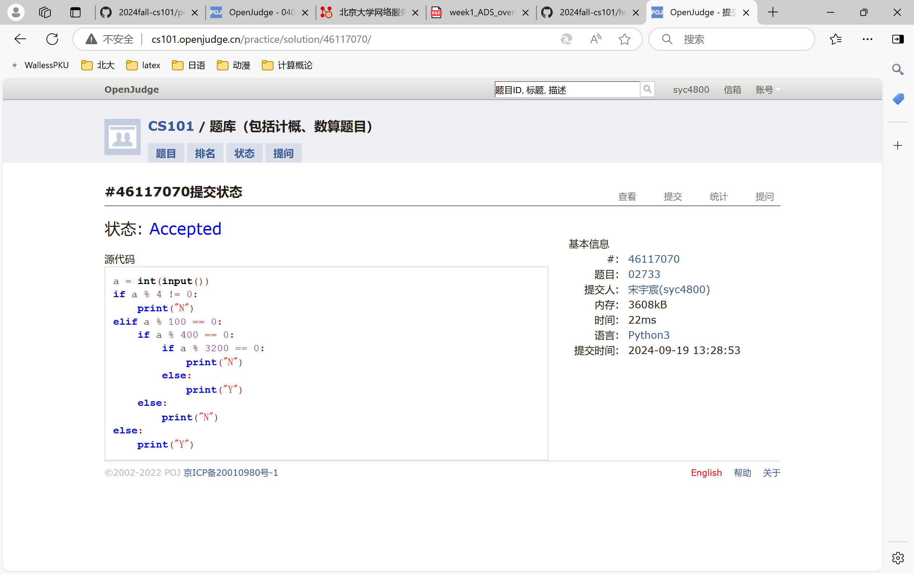
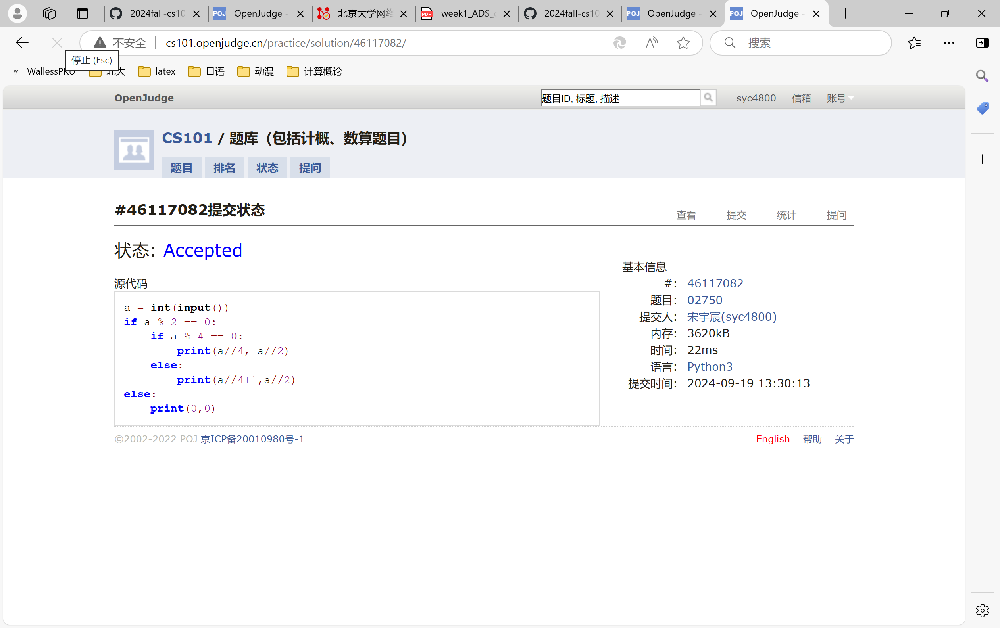
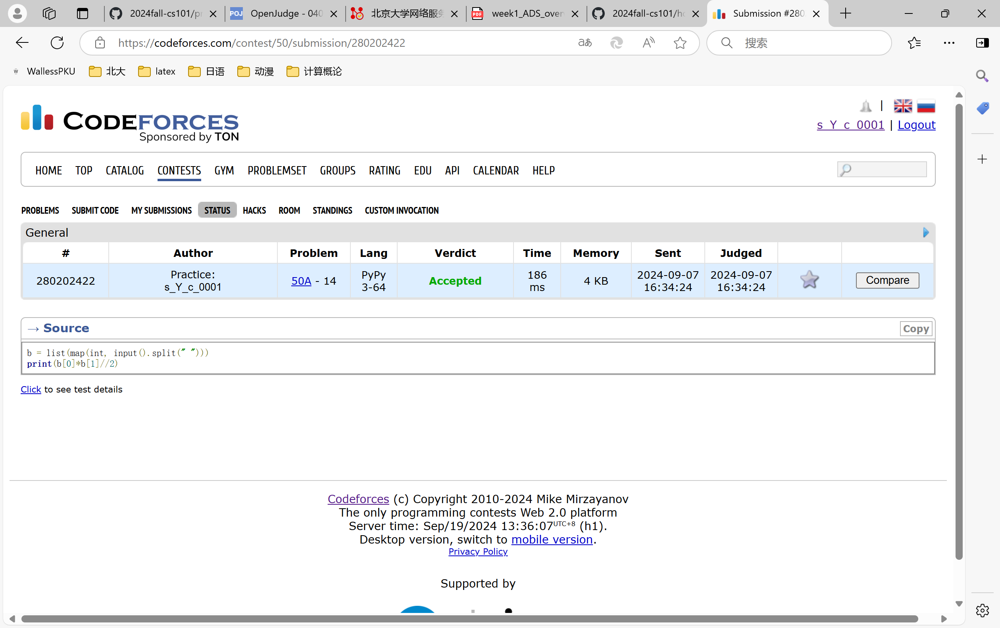
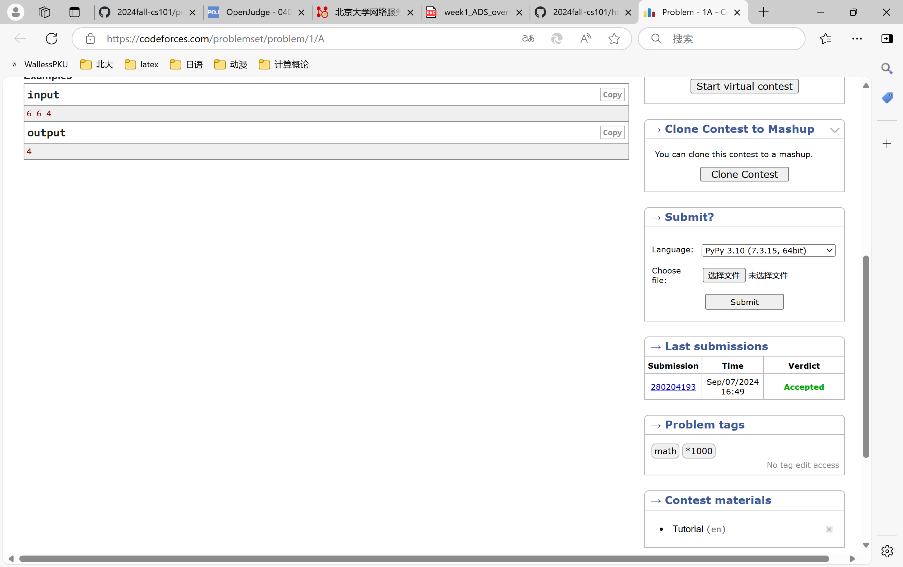
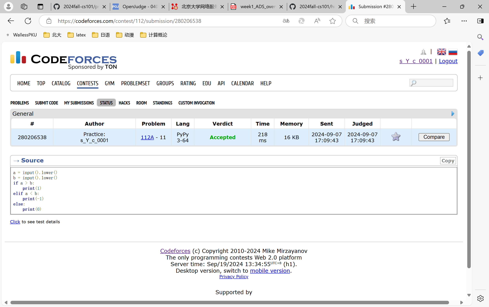
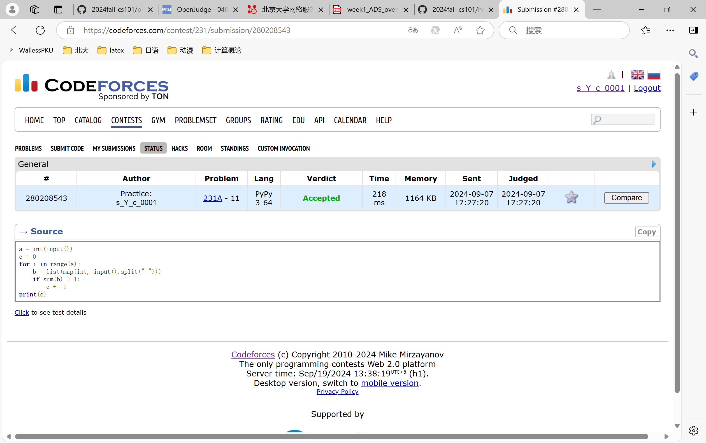

# Assignment #1: 自主学习

Updated 0110 GMT+8 Sep 10, 2024

2024 fall, Complied by ==宋宇宸、元培学院==


**说明：**

1）请把每个题目解题思路（可选），源码Python, 或者C++（已经在Codeforces/Openjudge上AC），截图（包含Accepted），填写到下面作业模版中（推荐使用 typora https://typoraio.cn ，或者用word）。AC 或者没有AC，都请标上每个题目大致花费时间。

3）课程网站是Canvas平台, https://pku.instructure.com, 学校通知9月19日导入选课名单后启用。**作业写好后，保留在自己手中，待9月20日提交。**

提交时候先提交pdf文件，再把md或者doc文件上传到右侧“作业评论”。Canvas需要有同学清晰头像、提交文件有pdf、"作业评论"区有上传的md或者doc附件。

4）如果不能在截止前提交作业，请写明原因。


## 1. 题目

### 02733: 判断闰年

http://cs101.openjudge.cn/practice/02733/


思路：


##### 代码

```python
a = int(input())
if a % 4 != 0:
    print("N")
elif a % 100 == 0:
    if a % 400 == 0:
        if a % 3200 == 0:
            print("N")
        else:
            print("Y")
    else:
        print("N")
else:
    print("Y")

```


代码运行截图 ==（至少包含有"Accepted"）==



### 02750: 鸡兔同笼

http://cs101.openjudge.cn/practice/02750/


思路：


##### 代码

```python
a = int(input())
if a % 2 == 0:
    if a % 4 == 0:
        print(a//4, a//2)
    else:
        print(a//4+1,a//2)
else:
    print(0,0)

```


代码运行截图 ==（至少包含有"Accepted"）==



### 50A. Domino piling

greedy, math, 800, http://codeforces.com/problemset/problem/50/A


思路：


##### 代码

```python
b = list(map(int, input().split(" ")))
print(b[0]*b[1]//2)


```


代码运行截图 ==（AC代码截图，至少包含有"Accepted"）==



### 1A. Theatre Square

math, 1000, https://codeforces.com/problemset/problem/1/A


思路：


##### 代码

```python
import math
a = list(map(int, input().split(" ")))
b = math.ceil(a[0] / a[2]) * math.ceil(a[1] / a[2])
print(b)

```


代码运行截图 ==（AC代码截图，至少包含有"Accepted"）==


### 112A. Petya and Strings

implementation, strings, 1000, http://codeforces.com/problemset/problem/112/A


思路：


##### 代码

```python
a = input().lower()
b = input().lower()
if a > b:
    print(1)
elif a < b:
    print(-1)
else:
    print(0)


```


代码运行截图 ==（AC代码截图，至少包含有"Accepted"）==


### 231A. Team

bruteforce, greedy, 800, http://codeforces.com/problemset/problem/231/A


思路：


##### 代码

```python
a = int(input())
c = 0
for i in range(a):
    b = list(map(int, input().split(" ")))
    if sum(b) > 1:
        c += 1
print(c)

```


代码运行截图 ==（AC代码截图，至少包含有"Accepted"）==



## 2. 学习总结和收获

==如果作业题目简单，有否额外练习题目，比如：OJ“计概2024fall每日选做”、CF、LeetCode、洛谷等网站题目。==
编程还是很有意思的呢


