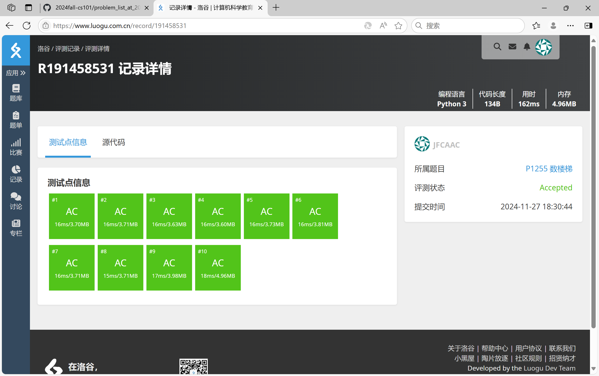
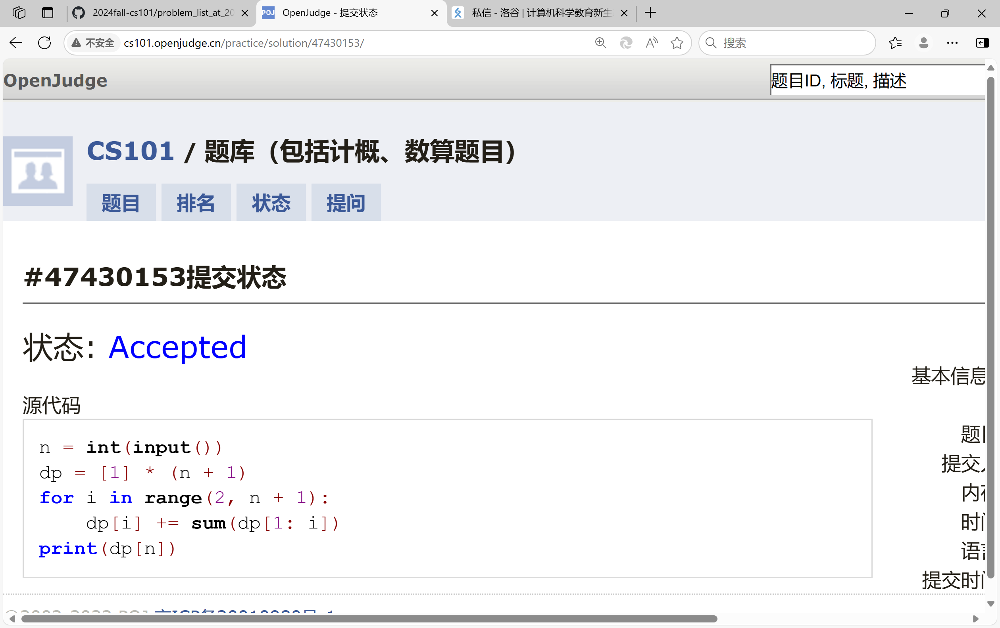
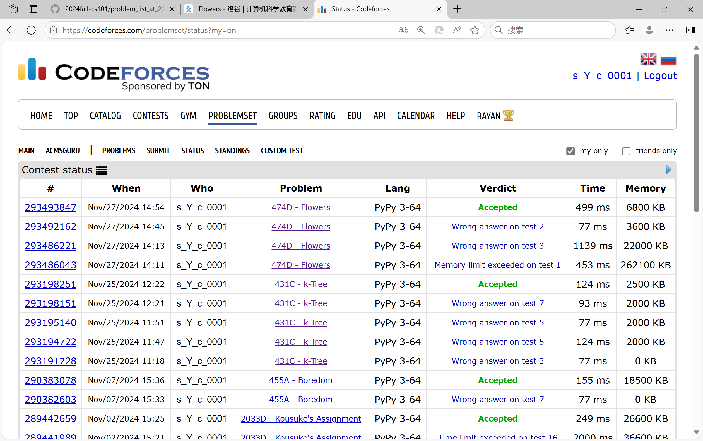
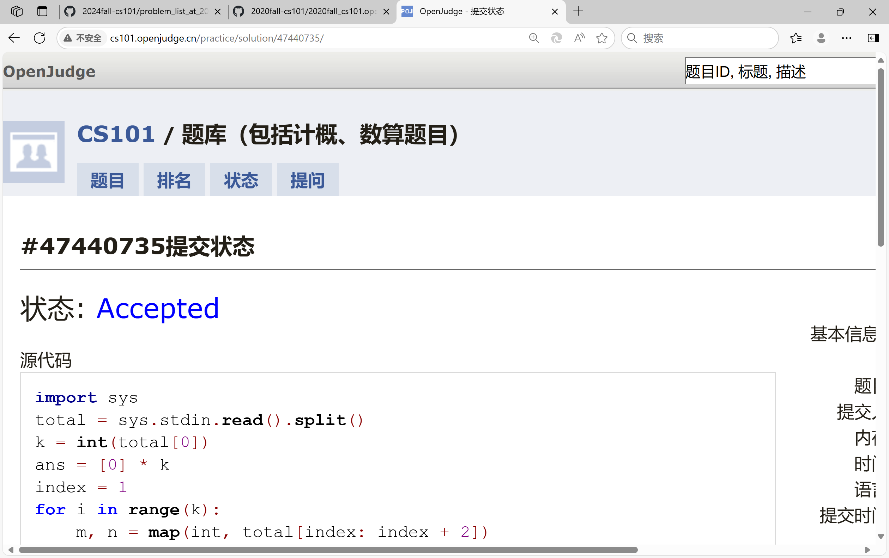
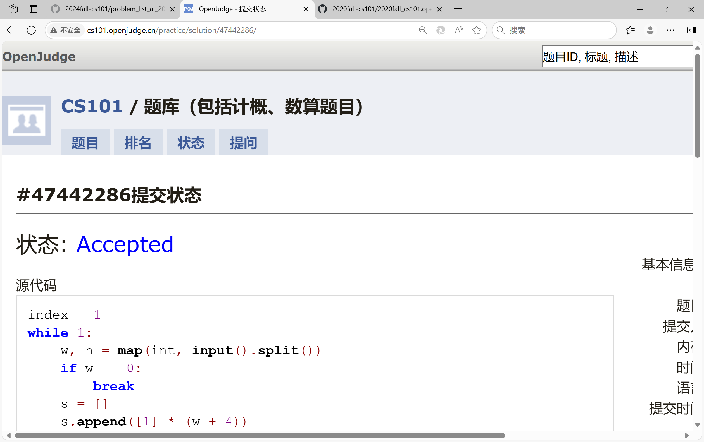

# Assignment #10: dp & bfs

Updated 2 GMT+8 Nov 25, 2024

2024 fall, Complied by <mark>宋宇宸 元培学院</mark>


**说明：**

1）请把每个题目解题思路（可选），源码Python, 或者C++（已经在Codeforces/Openjudge上AC），截图（包含Accepted），填写到下面作业模版中（推荐使用 typora https://typoraio.cn ，或者用word）。AC 或者没有AC，都请标上每个题目大致花费时间。

2）提交时候先提交pdf文件，再把md或者doc文件上传到右侧“作业评论”。Canvas需要有同学清晰头像、提交文件有pdf、"作业评论"区有上传的md或者doc附件。

3）如果不能在截止前提交作业，请写明原因。


## 1. 题目

### LuoguP1255 数楼梯

dp, bfs, https://www.luogu.com.cn/problem/P1255

思路：


代码：

```python
n = int(input())
dp = [0] * (n + 1)
dp[0] = 1
dp[1] = 1
for i in range(2, n + 1):
    dp[i] = dp[i - 1] + dp[i - 2]
print(dp[n])
```


代码运行截图 <mark>（至少包含有"Accepted"）</mark>



### 27528: 跳台阶

dp, http://cs101.openjudge.cn/practice/27528/

思路：


代码：

```python
n = int(input())
dp = [1] * (n + 1)
for i in range(2, n + 1):
    dp[i] += sum(dp[1: i])
print(dp[n])
```


代码运行截图 ==（至少包含有"Accepted"）==



### 474D. Flowers

dp, https://codeforces.com/problemset/problem/474/D

思路：


代码：

```python
t, k = map(int, input().split())
dp1 = [0] * 100001 #红结尾
dp2 = [0] * 100001 #白结尾，要求连续k
s = 1 #所有白结尾的个数+1
ss = [1] * k #所有红结尾的个数
for i in range(1, k):
    dp1[i] = i
for i in range(k, 100001):
    dp1[i] = (s + dp1[i - 1]) % 1000000007
    dp2[i] = (ss[i % k] + dp2[i - 1]) % 1000000007
    ss[i % k] = (s + ss[i % k]) % 1000000007
    s = dp2[i] + 1
for i in range(t):
    a, b = map(int, input().split())
    print((dp1[b] + dp2[b] - dp1[a - 1] - dp2[a - 1]) % 1000000007)
```


代码运行截图 <mark>（至少包含有"Accepted"）</mark>



### LeetCode5.最长回文子串

dp, two pointers, string, https://leetcode.cn/problems/longest-palindromic-substring/

思路：


代码：

```python
class Solution(object):
    def longestPalindrome(self, s):
        """
        :type s: str
        :rtype: str
        """
        dp = [[0] * (len(s) + 1) for _ in range(len(s) + 1)]
        for i in range(len(s)):
            dp[i][i] = 1
            dp[i][i + 1] = 1
        for i in range(2, len(s) + 1):
            for j in range(0, len(s) - i + 1):
                if dp[j + 1][j + i - 1] == 1 and s[j] == s[j + i - 1]:
                    dp[j][j + i] = 1
        for i in range(len(s), 0, -1):
            for j in range(0, len(s) - i + 1):
                if dp[j][j + i] == 1:
                    return s[j: j + i]
```


代码运行截图 <mark>（至少包含有"Accepted"）</mark>


### 12029: 水淹七军

bfs, dfs, http://cs101.openjudge.cn/practice/12029/

思路：


代码：

```python
import sys
total = sys.stdin.read().split()
k = int(total[0])
ans = [0] * k
index = 1
for i in range(k):
    m, n = map(int, total[index: index + 2])
    index += 2
    s = []
    s.append([1001] * (n + 2))
    for j in range(m):
        s.append([1001] + list(map(int, total[index: index + n])) + [1001])
        index += n
    s.append([1001] * (n + 2))
    ii, jj = map(int, total[index: index + 2])
    index += 2
    p = int(total[index])
    index += 1
    pending = []
    for j in range(p):
        x, y = map(int, total[index: index + 2])
        index += 2
        pending.append((x, y, s[x][y]))
    t = [(-1, 0), (1, 0), (0, 1), (0, -1)]
    while len(pending):
        x, y, h = pending[0]
        if x == ii and y == jj:
            ans[i] = 1
            break
        pending = pending[1:]
        s[x][y] = h
        for dx, dy in t:
            if s[x + dx][y + dy] < h:
                pending.append((x + dx, y + dy, h))
for i in range(k):
    if ans[i]:
        print("Yes")
    else:
        print("No")
```


代码运行截图 <mark>（至少包含有"Accepted"）</mark>



### 02802: 小游戏

bfs, http://cs101.openjudge.cn/practice/02802/

思路：


代码：

```python
index = 1
while 1:
    w, h = map(int, input().split())
    if w == 0:
        break
    s = []
    s.append([1] * (w + 4))
    s.append([1] + [0] * (w + 2) + [1])
    for i in range(h):
        l = [1, 0]
        t = input()
        for j in t:
            if j == ' ':
                l.append(0)
            else:
                l.append(1)
        l += [0, 1]
        s.append(l)
    s.append([1] + [0] * (w + 2) + [1])
    s.append([1] * (w + 4))
    t = [(1, 0), (-1, 0), (0, 1), (0, -1)]
    def search(x1, y1, x2, y2):
        p = [(x1, y1, 0, 0, 0)]
        check = [[0] * (w + 4) for _ in range(h + 4)]
        while len(p):
            x, y, l, d1, d2 = p[0]
            check[x][y] = 1
            p = p[1:]
            x0 = x
            y0 = y
            for dx, dy in t:
                if abs(dx) == abs(d1) and abs(dy) == abs(d2):
                    continue
                x = x0
                y = y0
                while 1:
                    x += dx
                    y += dy
                    if x == x2 and y == y2:
                        return l + 1
                    if s[x][y] == 0:
                        if check[x][y] == 0:
                            p.append((x, y, l + 1, dx, dy))
                    else:
                        break
        return 0
    print(f"Board #{index}:")
    j = 1
    while 1:
        x1, y1, x2, y2 = map(int, input().split())
        if x1 == 0:
            break
        ans = search(y1 + 1, x1 + 1, y2 + 1, x2 + 1)
        if ans:
            print(f"Pair {j}: {ans} segments.")
        else:
            print(f"Pair {j}: impossible.")
        j += 1
    print()
    index += 1
```


代码运行截图 <mark>（至少包含有"Accepted"）</mark>



## 2. 学习总结和收获

<mark>如果作业题目简单，有否额外练习题目，比如：OJ“计概2024fall每日选做”、CF、LeetCode、洛谷等网站题目。</mark>

被水淹七军的re狠狠地锻炼了心态


