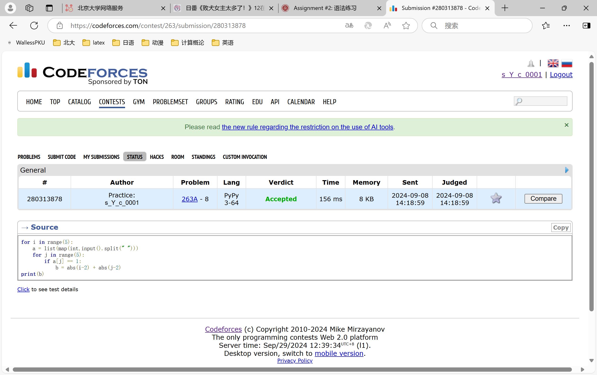
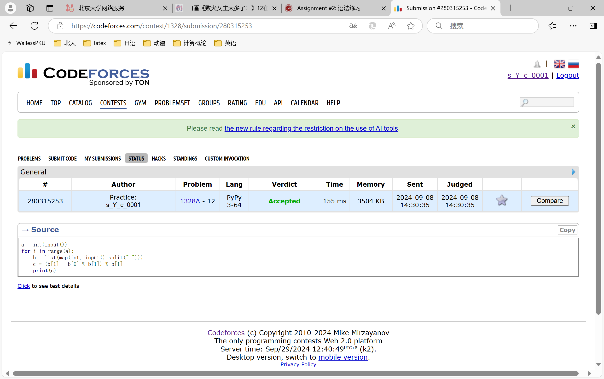
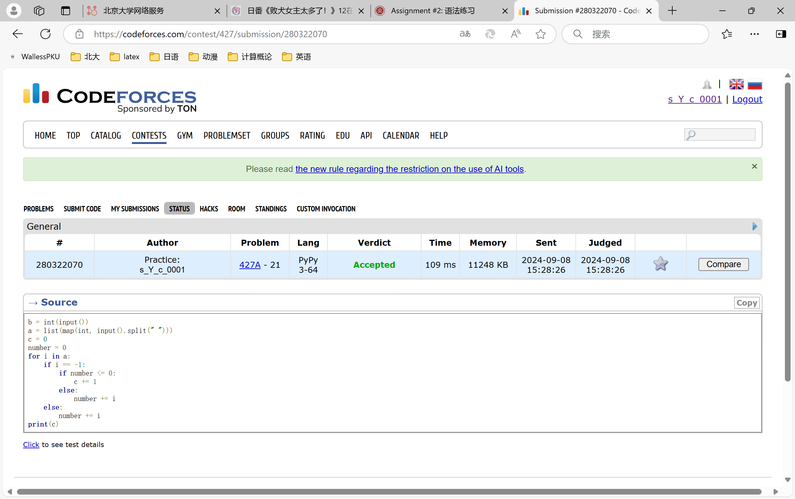
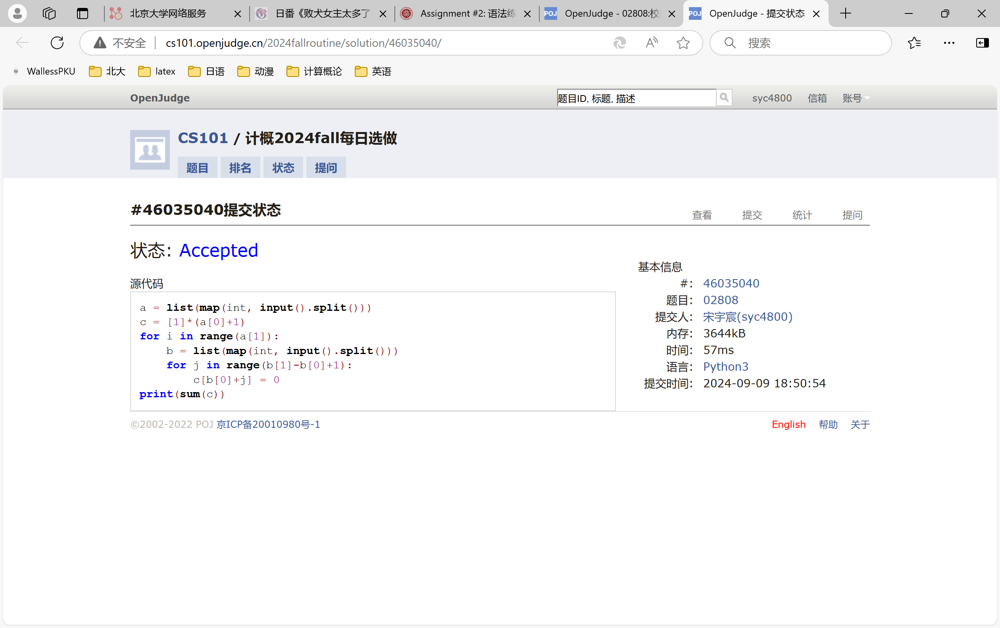
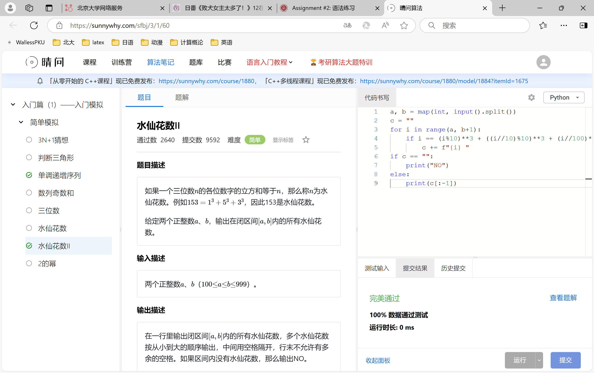
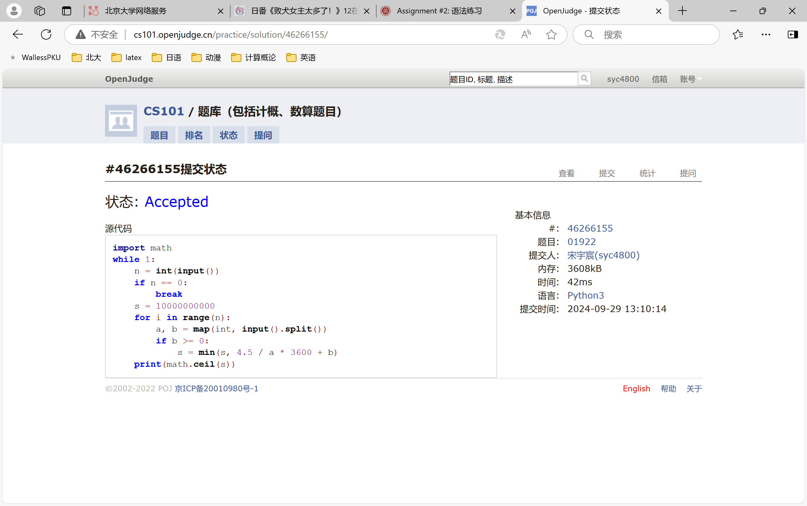

# Assignment #2: 语法练习

Updated 0126 GMT+8 Sep 24, 2024

2024 fall, Complied by ==宋宇宸 元培学院==


**说明：**

1）请把每个题目解题思路（可选），源码Python, 或者C++（已经在Codeforces/Openjudge上AC），截图（包含Accepted），填写到下面作业模版中（推荐使用 typora https://typoraio.cn ，或者用word）。AC 或者没有AC，都请标上每个题目大致花费时间。

3）课程网站是Canvas平台, https://pku.instructure.com, 学校通知9月19日导入选课名单后启用。**作业写好后，保留在自己手中，待9月20日提交。**

提交时候先提交pdf文件，再把md或者doc文件上传到右侧“作业评论”。Canvas需要有同学清晰头像、提交文件有pdf、"作业评论"区有上传的md或者doc附件。

4）如果不能在截止前提交作业，请写明原因。


## 1. 题目

### 263A. Beautiful Matrix

https://codeforces.com/problemset/problem/263/A


思路：


##### 代码

```python
for i in range(5):
    a = list(map(int,input().split(" ")))
    for j in range(5):
        if a[j] == 1:
            b = abs(i-2) + abs(j-2)
print(b)

```


代码运行截图 ==（至少包含有"Accepted"）==



### 1328A. Divisibility Problem

https://codeforces.com/problemset/problem/1328/A


思路：


##### 代码

```python
a = int(input())
for i in range(a):
    b = list(map(int, input().split(" ")))
    c = (b[1] - b[0] % b[1]) % b[1]
    print(c)
```


代码运行截图 ==（至少包含有"Accepted"）==



### 427A. Police Recruits

https://codeforces.com/problemset/problem/427/A


思路：


##### 代码

```python
b = int(input())
a = list(map(int, input().split(" ")))
c = 0
number = 0
for i in a:
    if i == -1:
        if number <= 0:
            c += 1
        else:
            number += i
    else:
        number += i
print(c)
```


代码运行截图 ==（AC代码截图，至少包含有"Accepted"）==



### 02808: 校门外的树

http://cs101.openjudge.cn/practice/02808/


思路：


##### 代码

```python
# 
a = list(map(int, input().split()))
c = [1]*(a[0]+1)
for i in range(a[1]):
    b = list(map(int, input().split()))
    for j in range(b[1]-b[0]+1):
        c[b[0]+j] = 0
print(sum(c))
```


代码运行截图 ==（AC代码截图，至少包含有"Accepted"）==



### sy60: 水仙花数II

https://sunnywhy.com/sfbj/3/1/60


思路：


##### 代码

```python
a, b = map(int, input().split())
c = ""
for i in range(a, b+1):
    if i == (i%10)**3 + ((i//10)%10)**3 + (i//100)**3:
        c += f"{i} "
if c == "":
    print("NO")
else:
    print(c[:-1])
```


代码运行截图 ==（AC代码截图，至少包含有"Accepted"）==



### 01922: Ride to School

http://cs101.openjudge.cn/practice/01922/


思路：


##### 代码

```python
# 
import math
while 1:
    n = int(input())
    if n == 0:
        break
    s = 10000000000
    for i in range(n):
        a, b = map(int, input().split())
        if b >= 0:
            s = min(s, 4.5 / a * 3600 + b)
    print(math.ceil(s))
```


代码运行截图 ==（AC代码截图，至少包含有"Accepted"）==



## 2. 学习总结和收获

==如果作业题目简单，有否额外练习题目，比如：OJ“计概2024fall每日选做”、CF、LeetCode、洛谷等网站题目。==
在跟着每日两题的进度做，感觉还是对语法熟练了一些


