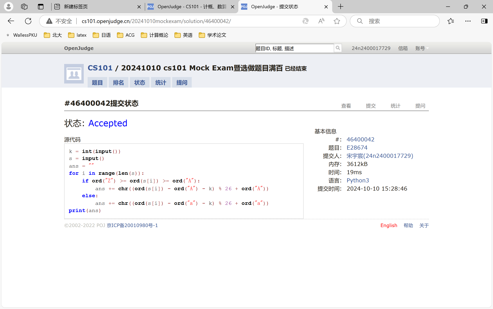
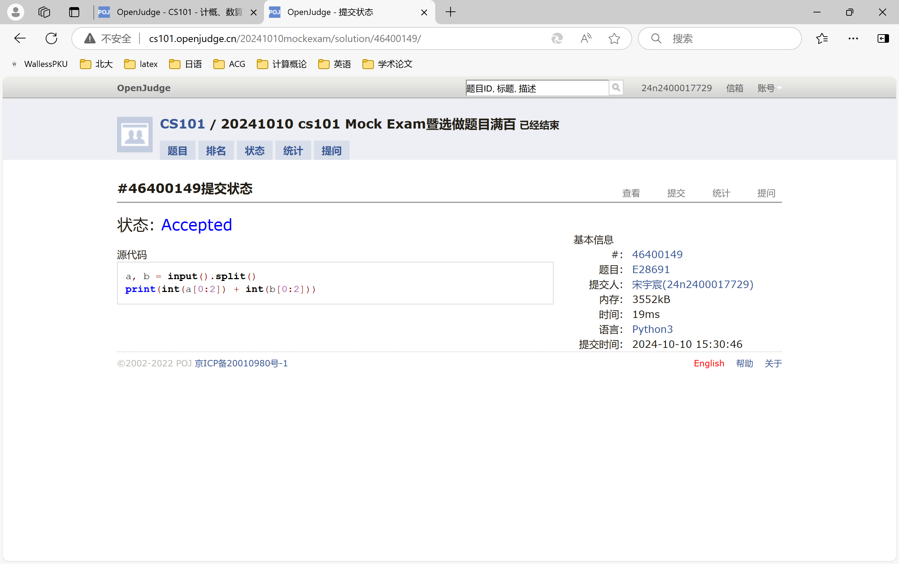
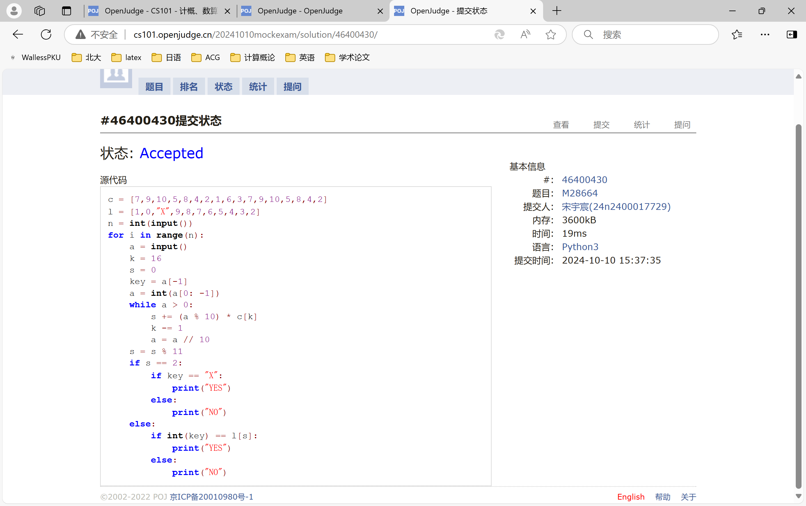
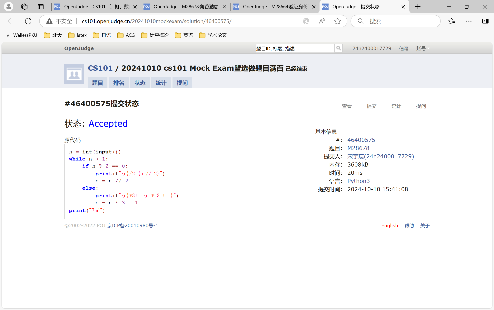
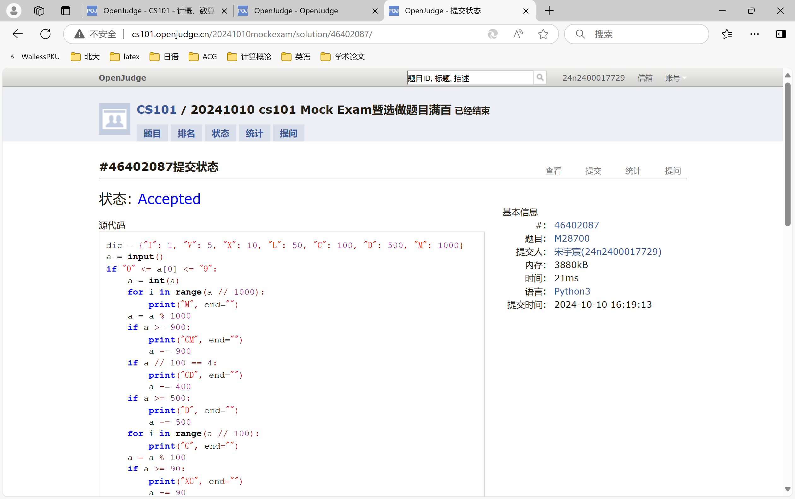
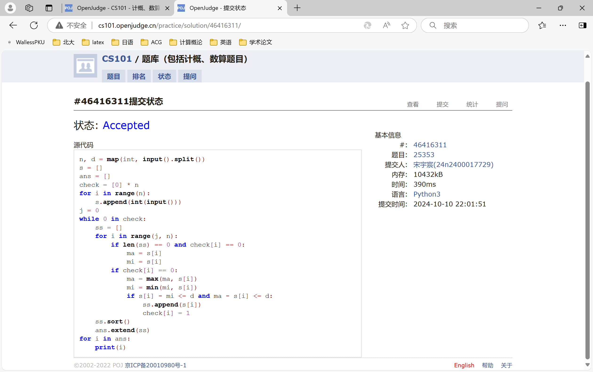

# Assign #3: Oct Mock Exam暨选做题目满百

Updated 1537 GMT+8 Oct 10, 2024

2024 fall, Complied by Hongfei Yan==宋宇宸 元培学院==


**说明：**

1）Oct⽉考： AC6==5== 。考试题⽬都在“题库（包括计概、数算题目）”⾥⾯，按照数字题号能找到，可以重新提交。作业中提交⾃⼰最满意版本的代码和截图。

2）请把每个题目解题思路（可选），源码Python, 或者C++/C（已经在Codeforces/Openjudge上AC），截图（包含Accepted, 学号），填写到下面作业模版中（推荐使用 typora https://typoraio.cn ，或者用word）。AC 或者没有AC，都请标上每个题目大致花费时间。

3）提交时候先提交pdf文件，再把md或者doc文件上传到右侧“作业评论”。Canvas需要有同学清晰头像、提交文件有pdf、作业评论有md或者doc。

4）如果不能在截止前提交作业，请写明原因。


## 1. 题目

### E28674:《黑神话：悟空》之加密

http://cs101.openjudge.cn/practice/28674/


思路：


代码

```python
k = int(input())
s = input()
ans = ""
for i in range(len(s)):
    if ord("Z") >= ord(s[i]) >= ord("A"):
        ans += chr((ord(s[i]) - ord("A") - k) % 26 + ord("A"))
    else:
        ans += chr((ord(s[i]) - ord("a") - k) % 26 + ord("a"))
print(ans)
```


代码运行截图 ==（至少包含有"Accepted"）==


### E28691: 字符串中的整数求和

http://cs101.openjudge.cn/practice/28691/


思路：


代码

```python
a, b = input().split()
print(int(a[0:2]) + int(b[0:2]))
```


代码运行截图 ==（至少包含有"Accepted"）==



### M28664: 验证身份证号

http://cs101.openjudge.cn/practice/28664/


思路：


代码

```python
c = [7,9,10,5,8,4,2,1,6,3,7,9,10,5,8,4,2]
l = [1,0,"X",9,8,7,6,5,4,3,2]
n = int(input())
for i in range(n):
    a = input()
    k = 16
    s = 0
    key = a[-1]
    a = int(a[0: -1])
    while a > 0:
        s += (a % 10) * c[k]
        k -= 1
        a = a // 10
    s = s % 11
    if s == 2:
        if key == "X":
            print("YES")
        else:
            print("NO")
    else:
        if int(key) == l[s]:
            print("YES")
        else:
            print("NO")
```


代码运行截图 ==（AC代码截图，至少包含有"Accepted"）==


### M28678: 角谷猜想

http://cs101.openjudge.cn/practice/28678/


思路：


代码

```python
n = int(input())
while n > 1:
    if n % 2 == 0:
        print(f"{n}/2={n // 2}")
        n = n // 2
    else:
        print(f"{n}*3+1={n * 3 + 1}")
        n = n * 3 + 1
print("End")
```


代码运行截图 ==（AC代码截图，至少包含有"Accepted"）==


### M28700: 罗马数字与整数的转换

http://cs101.openjudge.cn/practice/28700/


思路：


##### 代码

```python
dic = {"I": 1, "V": 5, "X": 10, "L": 50, "C": 100, "D": 500, "M": 1000}
a = input()
if "0" <= a[0] <= "9":
    a = int(a)
    for i in range(a // 1000):
        print("M", end="")
    a = a % 1000
    if a >= 900:
        print("CM", end="")
        a -= 900
    if a // 100 == 4:
        print("CD", end="")
        a -= 400
    if a >= 500:
        print("D", end="")
        a -= 500
    for i in range(a // 100):
        print("C", end="")
    a = a % 100
    if a >= 90:
        print("XC", end="")
        a -= 90
    if a // 10 == 4:
        print("XL", end="")
        a -= 40
    if a >= 50:
        print("L", end="")
        a -= 50
    for i in range(a // 10):
        print("X", end="")
    a = a % 10
    if a >= 9:
        print("IX", end="")
        a -= 9
    if a // 1 == 4:
        print("IV", end="")
        a -= 4
    if a >= 5:
        print("V", end="")
        a -= 5
    for i in range(a // 1):
        print("I", end="")
else:
    s = 0
    if a.find("CM") != -1:
        s += 900
        a = a[0: a.find("CM")] + a[a.find("CM") + 2:]
    while a.find("M") != -1:
        s += 1000
        a = a[1:]
    if a.find("CD") != -1:
        s += 400
        a = a[0: a.find("CD")] + a[a.find("CD") + 2:]
    if a.find("D") != -1:
        s += 500
        a = a[1:]
    if a.find("XC") != -1:
        s += 90
        a = a[0: a.find("XC")] + a[a.find("XC") + 2:]
    while a.find("C") != -1:
        s += 100
        a = a[1:]
    if a.find("XL") != -1:
        s += 40
        a = a[0: a.find("XL")] + a[a.find("XL") + 2:]
    if a.find("L") != -1:
        s += 50
        a = a[1:]
    if a.find("IX") != -1:
        s += 9
        a = a[0: a.find("IX")] + a[a.find("IX") + 2:]
    while a.find("X") != -1:
        s += 10
        a = a[1:]
    if a.find("IV") != -1:
        s += 4
        a = a[0: a.find("IV")] + a[a.find("IV") + 2:]
    if a.find("V") != -1:
        s += 5
        a = a[1:]
    while a.find("I") != -1:
        s += 1
        a = a[1:]
    print(s)
```


代码运行截图 ==（AC代码截图，至少包含有"Accepted"）==



### *T25353: 排队 （选做）

http://cs101.openjudge.cn/practice/25353/


思路：


代码

```python
n, d = map(int, input().split())
s = []
ans = []
check = [0] * n
for i in range(n):
    s.append(int(input()))
j = 0
while 0 in check:
    ss = []
    for i in range(j, n):
        if len(ss) == 0 and check[i] == 0:
            ma = s[i]
            mi = s[i]
        if check[i] == 0:
            ma = max(ma, s[i])
            mi = min(mi, s[i])
            if s[i] - mi <= d and ma - s[i] <= d:
                ss.append(s[i])
                check[i] = 1
    ss.sort()
    ans.extend(ss)
for i in ans:
    print(i)
```


代码运行截图 ==（AC代码截图，至少包含有"Accepted"）==



## 2. 学习总结和收获

==如果作业题目简单，有否额外练习题目，比如：OJ“计概2024fall每日选做”、CF、LeetCode、洛谷等网站题目。==
月考没能AK，还需努力（最后一题答案的优化方式实在是素晴らしい）


