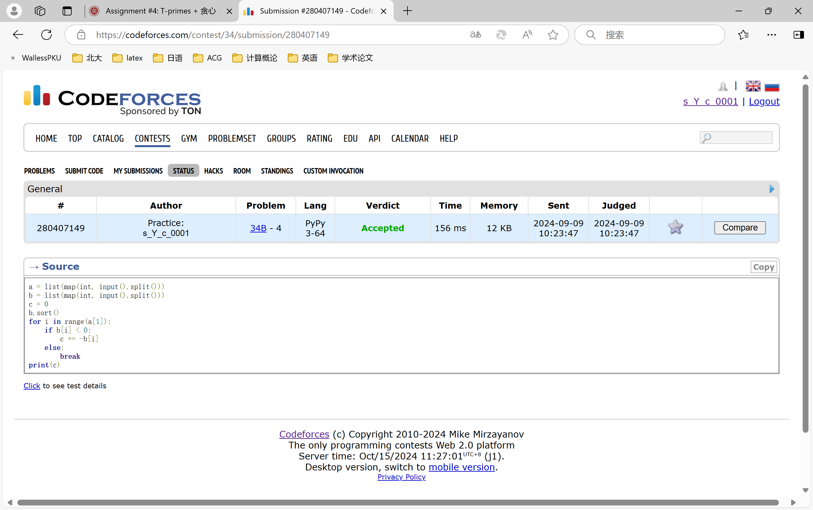
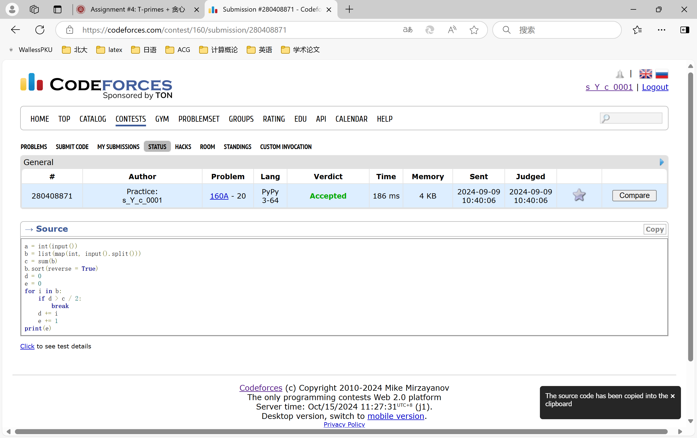
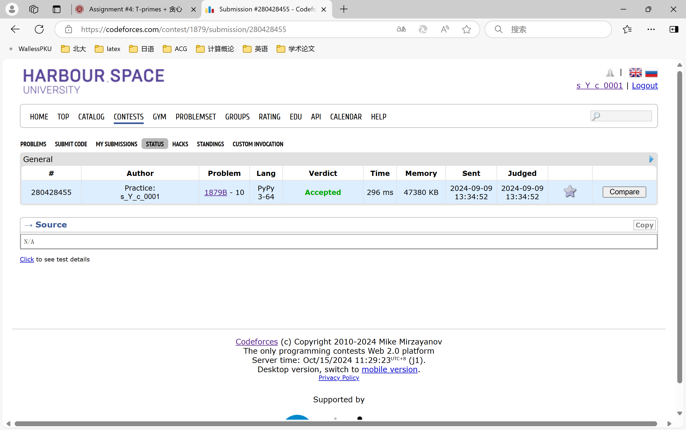
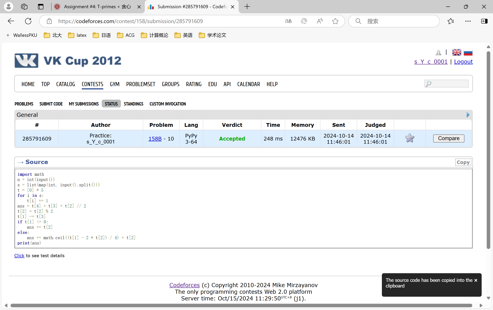
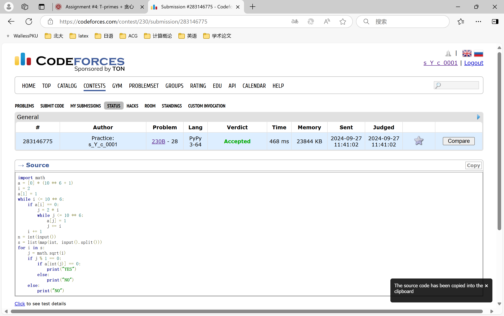
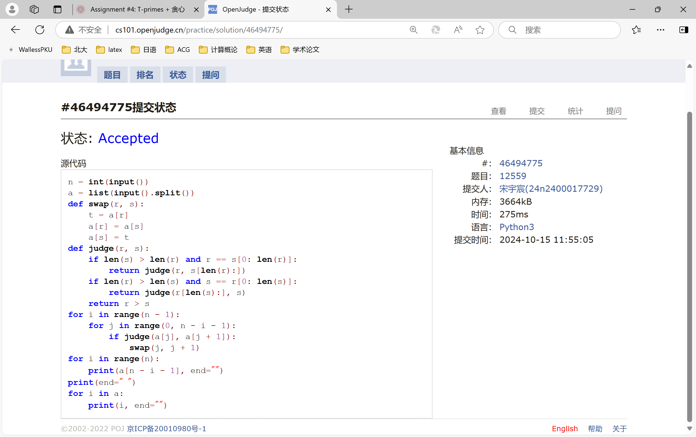

# Assignment #4: T-primes + 贪心

Updated 0337 GMT+8 Oct 15, 2024

2024 fall, Complied by ==宋宇宸 元培学院==


**说明：**

1）请把每个题目解题思路（可选），源码Python, 或者C++（已经在Codeforces/Openjudge上AC），截图（包含Accepted），填写到下面作业模版中（推荐使用 typora https://typoraio.cn ，或者用word）。AC 或者没有AC，都请标上每个题目大致花费时间。

3）课程网站是Canvas平台, https://pku.instructure.com, 学校通知9月19日导入选课名单后启用。**作业写好后，保留在自己手中，待9月20日提交。**

提交时候先提交pdf文件，再把md或者doc文件上传到右侧“作业评论”。Canvas需要有同学清晰头像、提交文件有pdf、"作业评论"区有上传的md或者doc附件。

4）如果不能在截止前提交作业，请写明原因。


## 1. 题目

### 34B. Sale

greedy, sorting, 900, https://codeforces.com/problemset/problem/34/B


思路：


代码

```python
a = list(map(int, input().split()))
b = list(map(int, input().split()))
c = 0
b.sort()
for i in range(a[1]):
    if b[i] < 0:
        c += -b[i]
    else:
        break
print(c)
```


代码运行截图 ==（至少包含有"Accepted"）==



### 160A. Twins

greedy, sortings, 900, https://codeforces.com/problemset/problem/160/A

思路：


代码

```python
a = int(input())
b = list(map(int, input().split()))
c = sum(b)
b.sort(reverse = True)
d = 0
e = 0
for i in b:
    if d > c / 2:
        break
    d += i
    e += 1
print(e)
```


代码运行截图 ==（至少包含有"Accepted"）==




### 1879B. Chips on the Board

constructive algorithms, greedy, 900, https://codeforces.com/problemset/problem/1879/B

思路：


代码

```python

a = int(input())
for i in range(a):
    b = int(input())
    c = list(map(int, input().split()))
    d = list(map(int, input().split()))
    print(min(min(c)*b+sum(d),min(d)*b+sum(c)))
```


代码运行截图 ==（AC代码截图，至少包含有"Accepted"）==




### 158B. Taxi

*special problem, greedy, implementation, 1100, https://codeforces.com/problemset/problem/158/B

思路：


代码

```python

import math
n = int(input())
s = list(map(int, input().split()))
t = [0] * 5
for i in s:
    t[i] += 1
ans = t[4] + t[3] + t[2] // 2
t[2] = t[2] % 2
t[1] -= t[3]
if t[1] <= 0:
    ans += t[2]
else:
    ans += math.ceil((t[1] - 2 * t[2]) / 4) + t[2]
print(ans)
```


代码运行截图 ==（AC代码截图，至少包含有"Accepted"）==




### *230B. T-primes（选做）

binary search, implementation, math, number theory, 1300, http://codeforces.com/problemset/problem/230/B

思路：


代码

```python
import math
a = [0] * (10 ** 6 + 1)
i = 2
a[1] = 1
while i <= 10 ** 6:
    if a[i] == 0:
        j = 2 * i
        while j <= 10 ** 6:
            a[j] = 1
            j += i
    i += 1
n = int(input())
s = list(map(int, input().split()))
for i in s:
    j = math.sqrt(i)
    if j % 1 == 0:
        if a[int(j)] == 0:
            print("YES")
        else:
            print("NO")
    else:
        print("NO")

```


代码运行截图 ==（AC代码截图，至少包含有"Accepted"）==




### *12559: 最大最小整数 （选做）

greedy, strings, sortings, http://cs101.openjudge.cn/practice/12559

思路：


代码

```python

n = int(input())
a = list(input().split())
def swap(r, s):
    t = a[r]
    a[r] = a[s]
    a[s] = t
def judge(r, s):
    if len(s) > len(r) and r == s[0: len(r)]:
        return judge(r, s[len(r):])
    if len(r) > len(s) and s == r[0: len(s)]:
        return judge(r[len(s):], s)
    return r > s
for i in range(n - 1):
    for j in range(0, n - i - 1):
        if judge(a[j], a[j + 1]):
            swap(j, j + 1)
for i in range(n):
    print(a[n - i - 1], end="")
print(end=" ")
for i in a:
    print(i, end="")
```


代码运行截图 ==（AC代码截图，至少包含有"Accepted"）==




## 2. 学习总结和收获

==如果作业题目简单，有否额外练习题目，比如：OJ“计概2024fall每日选做”、CF、LeetCode、洛谷等网站题目。==题目有些难了，有的题需要调试好几次才能AC


