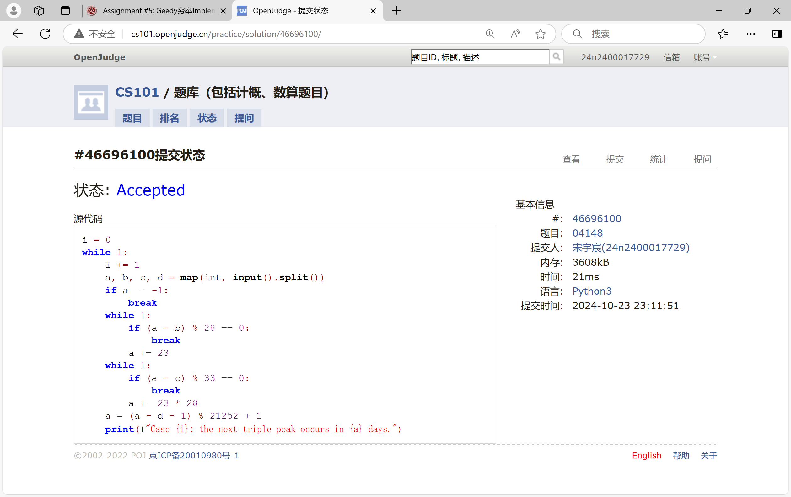
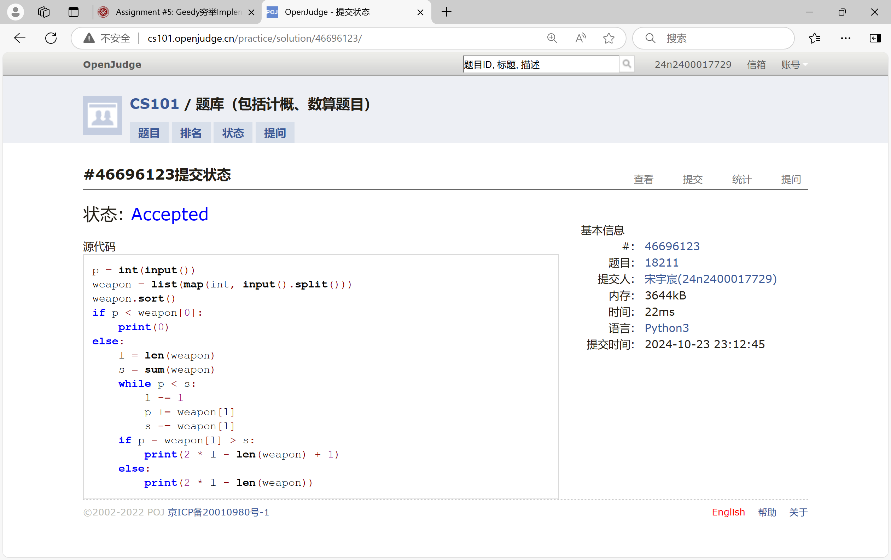
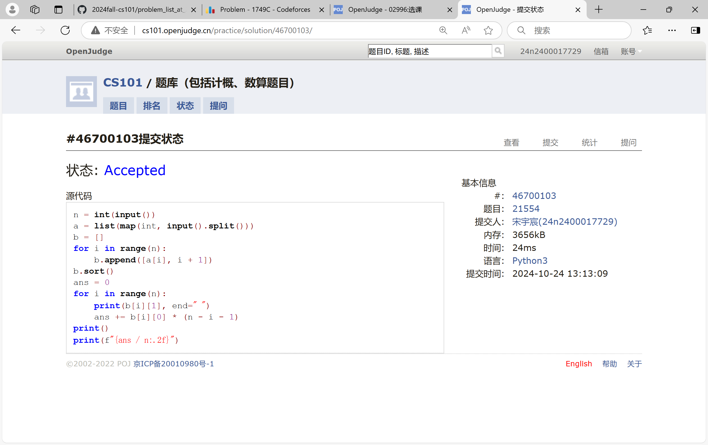
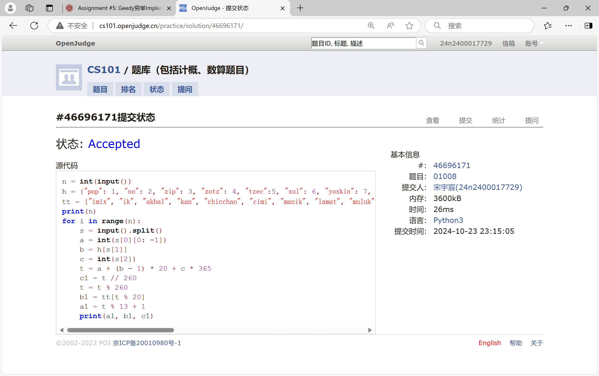
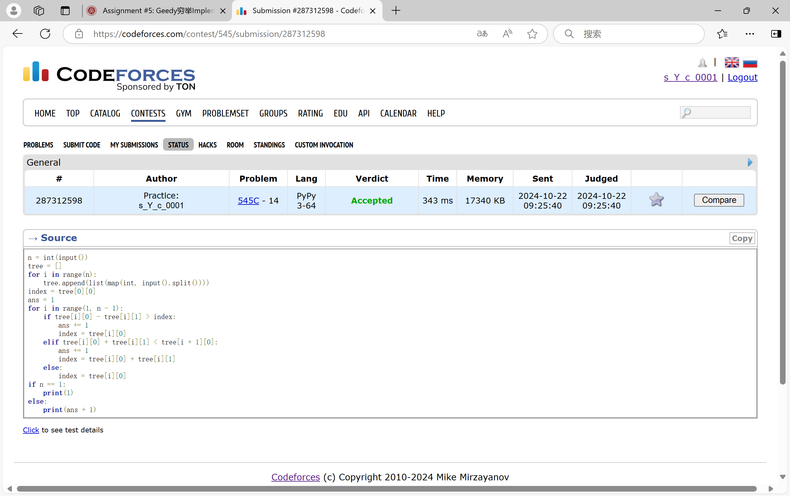
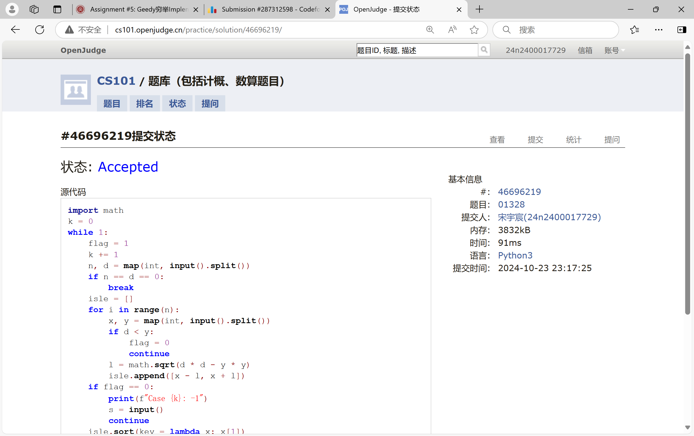

# Assignment #5: Greedy穷举Implementation

Updated 1939 GMT+8 Oct 21, 2024

2024 fall, Complied by <mark>宋宇宸 元培学院</mark>


**说明：**

1）请把每个题目解题思路（可选），源码Python, 或者C++（已经在Codeforces/Openjudge上AC），截图（包含Accepted），填写到下面作业模版中（推荐使用 typora https://typoraio.cn ，或者用word）。AC 或者没有AC，都请标上每个题目大致花费时间。

3）提交时候先提交pdf文件，再把md或者doc文件上传到右侧“作业评论”。Canvas需要有同学清晰头像、提交文件有pdf、"作业评论"区有上传的md或者doc附件。

4）如果不能在截止前提交作业，请写明原因。


## 1. 题目

### 04148: 生理周期

brute force, http://cs101.openjudge.cn/practice/04148

思路：


代码：

```python
i = 0
while 1:
    i += 1
    a, b, c, d = map(int, input().split())
    if a == -1:
        break
    while 1:
        if (a - b) % 28 == 0:
            break
        a += 23
    while 1:
        if (a - c) % 33 == 0:
            break
        a += 23 * 28
    a = (a - d - 1) % 21252 + 1
    print(f"Case {i}: the next triple peak occurs in {a} days.")
```


代码运行截图 <mark>（至少包含有"Accepted"）</mark>



### 18211: 军备竞赛

greedy, two pointers, http://cs101.openjudge.cn/practice/18211

思路：


代码：

```python
p = int(input())
weapon = list(map(int, input().split()))
weapon.sort()
if p < weapon[0]:
    print(0)
else:
    l = len(weapon)
    s = sum(weapon)
    while p < s:
        l -= 1
        p += weapon[l]
        s -= weapon[l]
    if p - weapon[l] > s:
        print(2 * l - len(weapon) + 1)
    else:
        print(2 * l - len(weapon))
```


代码运行截图 ==（至少包含有"Accepted"）==



### 21554: 排队做实验

greedy, http://cs101.openjudge.cn/practice/21554

思路：


代码：

```python
n = int(input())
a = list(map(int, input().split()))
b = []
for i in range(n):
    b.append([a[i], i + 1])
b.sort()
ans = 0
for i in range(n):
    print(b[i][1], end=" ")
    ans += b[i][0] * (n - i - 1)
print()
print(f"{ans / n:.2f}")
```


代码运行截图 <mark>（至少包含有"Accepted"）</mark>



### 01008: Maya Calendar

implementation, http://cs101.openjudge.cn/practice/01008/

思路：


代码：

```python
n = int(input())
h = {"pop": 1, "no": 2, "zip": 3, "zotz": 4, "tzec":5, "xul": 6, "yoxkin": 7, "mol": 8, "chen": 9, "yax": 10, "zac": 11, "ceh": 12, "mac": 13, "kankin": 14, "muan": 15, "pax": 16, "koyab": 17, "cumhu": 18, "uayet": 19}
tt = ["imix", "ik", "akbal", "kan", "chicchan", "cimi", "manik", "lamat", "muluk", "ok", "chuen", "eb", "ben", "ix", "mem", "cib", "caban", "eznab", "canac", "ahau"]
print(n)
for i in range(n):
    s = input().split()
    a = int(s[0][0: -1])
    b = h[s[1]]
    c = int(s[2])
    t = a + (b - 1) * 20 + c * 365
    c1 = t // 260
    t = t % 260
    b1 = tt[t % 20]
    a1 = t % 13 + 1
    print(a1, b1, c1)
```


代码运行截图 <mark>（至少包含有"Accepted"）</mark>



### 545C. Woodcutters

dp, greedy, 1500, https://codeforces.com/problemset/problem/545/C

思路：


代码：

```python
n = int(input())
tree = []
for i in range(n):
    tree.append(list(map(int, input().split())))
index = tree[0][0]
ans = 1
for i in range(1, n - 1):
    if tree[i][0] - tree[i][1] > index:
        ans += 1
        index = tree[i][0]
    elif tree[i][0] + tree[i][1] < tree[i + 1][0]:
        ans += 1
        index = tree[i][0] + tree[i][1]
    else:
        index = tree[i][0]
if n == 1:
    print(1)
else:
    print(ans + 1)
```


代码运行截图 <mark>（至少包含有"Accepted"）</mark>



### 01328: Radar Installation

greedy, http://cs101.openjudge.cn/practice/01328/

思路：


代码：

```python
import math
k = 0
while 1:
    flag = 1
    k += 1
    n, d = map(int, input().split())
    if n == d == 0:
        break
    isle = []
    for i in range(n):
        x, y = map(int, input().split())
        if d < y:
            flag = 0
            continue
        l = math.sqrt(d * d - y * y)
        isle.append([x - l, x + l])
    if flag == 0:
        print(f"Case {k}: -1")
        s = input()
        continue
    isle.sort(key = lambda x: x[1])
    check = [0] * n
    i = 0
    ans = 0
    while i < n:
        if check[i] == 0:
            ans += 1
            for j in range(i + 1, n):
                if isle[j][0] <= isle[i][1]:
                    check[j] = 1
        i += 1
    print(f"Case {k}: {ans}")
    s = input()
```


代码运行截图 <mark>（至少包含有"Accepted"）</mark>




## 2. 学习总结和收获

<mark>如果作业题目简单，有否额外练习题目，比如：OJ“计概2024fall每日选做”、CF、LeetCode、洛谷等网站题目。</mark>

在跟进每日选做，这周明显难了，很多题要好几次才可以ac


