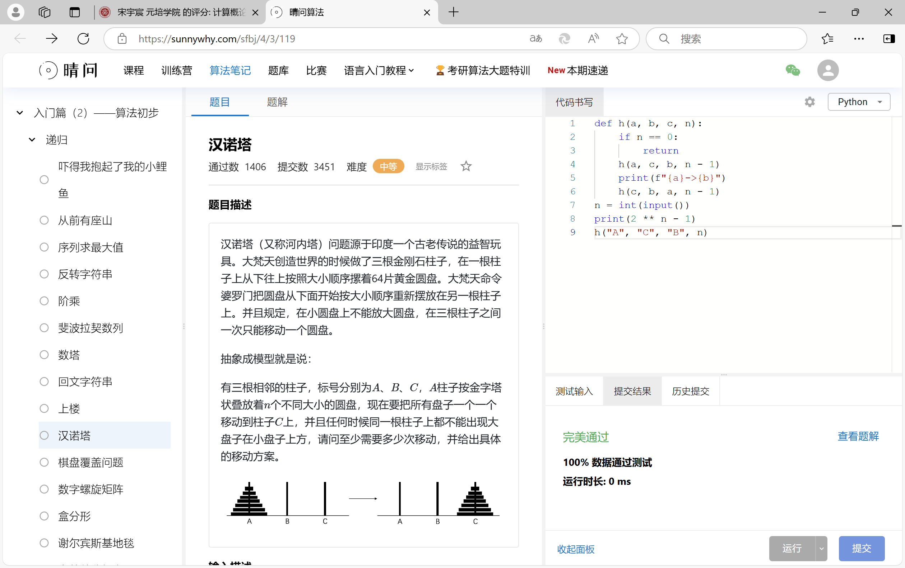
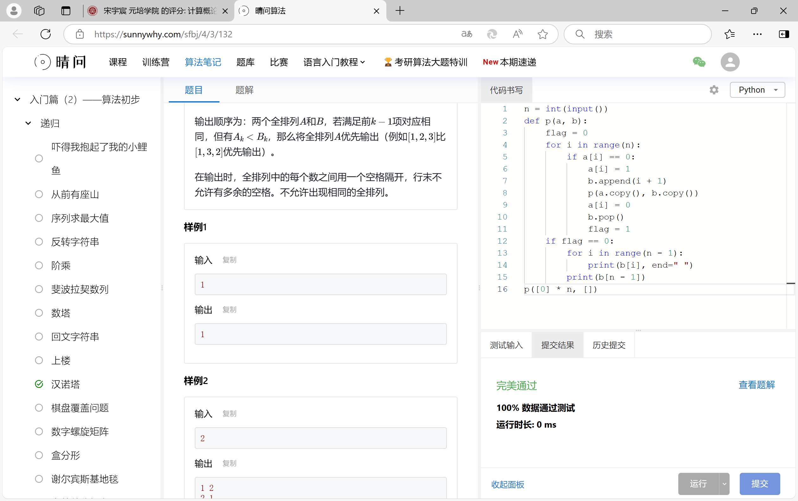
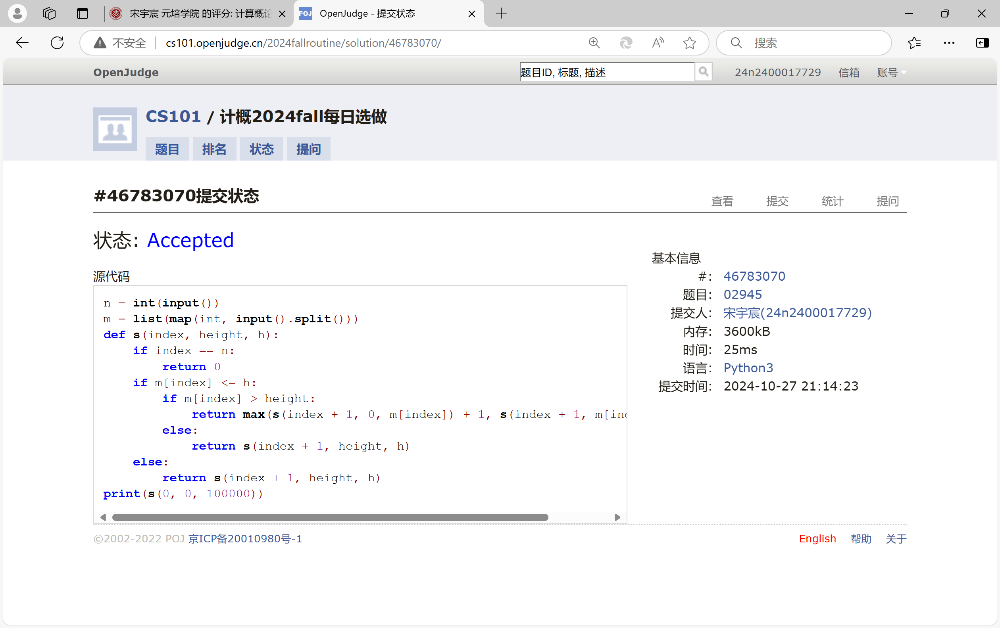
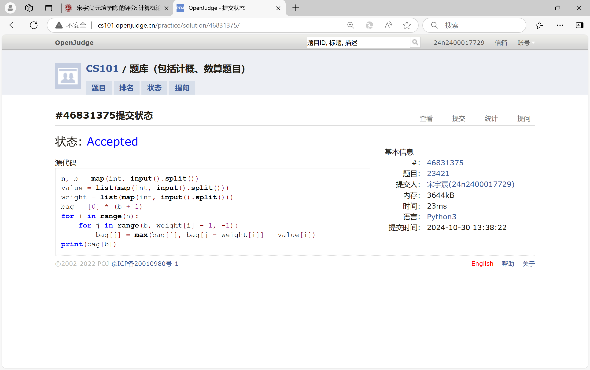
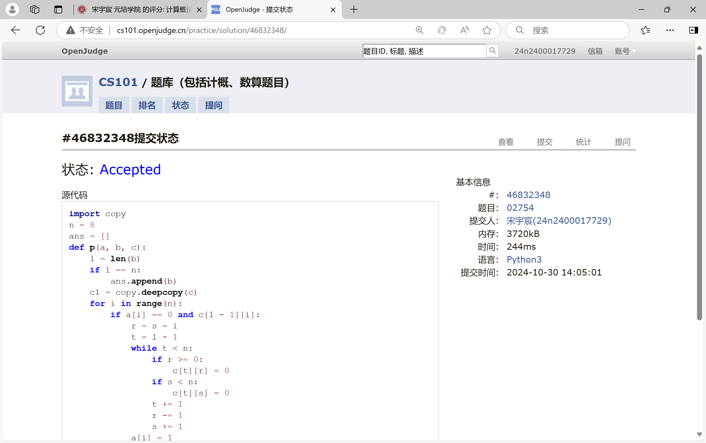
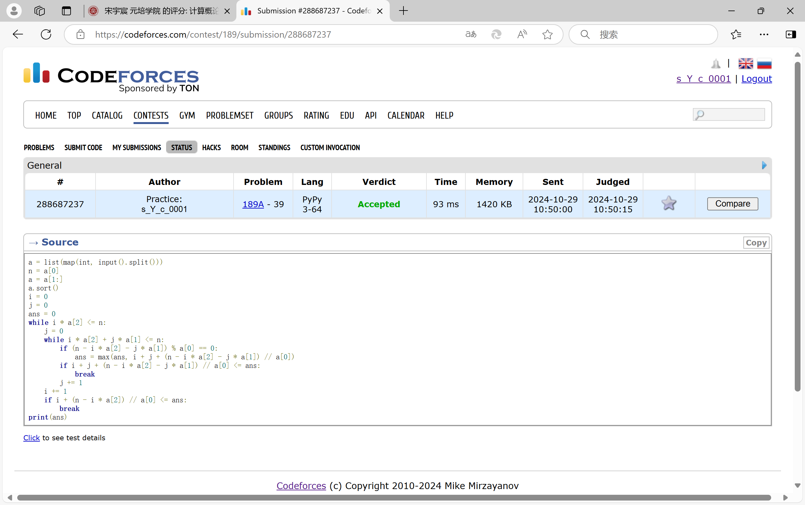

# Assignment #6: Recursion and DP

Updated 2201 GMT+8 Oct 29, 2024

2024 fall, Complied by <mark>宋宇宸 元培学院</mark>


**说明：**

1）请把每个题目解题思路（可选），源码Python, 或者C++（已经在Codeforces/Openjudge上AC），截图（包含Accepted），填写到下面作业模版中（推荐使用 typora https://typoraio.cn ，或者用word）。AC 或者没有AC，都请标上每个题目大致花费时间。

3）提交时候先提交pdf文件，再把md或者doc文件上传到右侧“作业评论”。Canvas需要有同学清晰头像、提交文件有pdf、"作业评论"区有上传的md或者doc附件。

4）如果不能在截止前提交作业，请写明原因。


## 1. 题目

### sy119: 汉诺塔

recursion, https://sunnywhy.com/sfbj/4/3/119  

思路：


代码：

```python
def h(a, b, c, n):
    if n == 0:
        return
    h(a, c, b, n - 1)
    print(f"{a}->{b}")
    h(c, b, a, n - 1)
n = int(input())
print(2 ** n - 1)
h("A", "C", "B", n)
```


代码运行截图 <mark>（至少包含有"Accepted"）</mark>



### sy132: 全排列I

recursion, https://sunnywhy.com/sfbj/4/3/132

思路：


代码：

```python
n = int(input())
def p(a, b):
    flag = 0
    for i in range(n):
        if a[i] == 0:
            a[i] = 1
            b.append(i + 1)
            p(a.copy(), b.copy())
            a[i] = 0
            b.pop()
            flag = 1
    if flag == 0:
        for i in range(n - 1):
            print(b[i], end=" ")
        print(b[n - 1])
p([0] * n, [])
```


代码运行截图 ==（至少包含有"Accepted"）==



### 02945: 拦截导弹 

dp, http://cs101.openjudge.cn/2024fallroutine/02945

思路：


代码：

```python
n = int(input())
m = list(map(int, input().split()))
def s(index, height, h):
    if index == n:
        return 0
    if m[index] <= h:
        if m[index] > height:
            return max(s(index + 1, 0, m[index]) + 1, s(index + 1, m[index], h))
        else:
            return s(index + 1, height, h)
    else:
        return s(index + 1, height, h)
print(s(0, 0, 100000))
```


代码运行截图 <mark>（至少包含有"Accepted"）</mark>



### 23421: 小偷背包 

dp, http://cs101.openjudge.cn/practice/23421

思路：


代码：

```python
n, b = map(int, input().split())
value = list(map(int, input().split()))
weight = list(map(int, input().split()))
bag = [0] * (b + 1)
for i in range(n):
    for j in range(b, weight[i] - 1, -1):
        bag[j] = max(bag[j], bag[j - weight[i]] + value[i])
print(bag[b])
```


代码运行截图 <mark>（至少包含有"Accepted"）</mark>



### 02754: 八皇后

dfs and similar, http://cs101.openjudge.cn/practice/02754

思路：


代码：

```python
import copy
n = 8
ans = []
def p(a, b, c):
    l = len(b)
    if l == n:
        ans.append(b)
    c1 = copy.deepcopy(c)
    for i in range(n):
        if a[i] == 0 and c[l - 1][i]:
            r = s = i
            t = l - 1
            while t < n:
                if r >= 0:
                    c[t][r] = 0
                if s < n:
                    c[t][s] = 0
                t += 1
                r -= 1
                s += 1
            a[i] = 1
            b.append(i + 1)
            p(a.copy(), b.copy(), copy.deepcopy(c))
            a[i] = 0
            b.pop()
            c = copy.deepcopy(c1)
p([0] * n, [], [[1 for i in range(n)] for j in range(n)])
t = int(input())
for i in range(t):
    s = int(input())
    for j in ans[s - 1]:
        print(j, end="")
    print()
```


代码运行截图 <mark>（至少包含有"Accepted"）</mark>



### 189A. Cut Ribbon 

brute force, dp 1300 https://codeforces.com/problemset/problem/189/A

思路：


代码：

```python
a = list(map(int, input().split()))
n = a[0]
a = a[1:]
a.sort()
i = 0
j = 0
ans = 0
while i * a[2] <= n:
    j = 0
    while i * a[2] + j * a[1] <= n:
        if (n - i * a[2] - j * a[1]) % a[0] == 0:
            ans = max(ans, i + j + (n - i * a[2] - j * a[1]) // a[0])
        if i + j + (n - i * a[2] - j * a[1]) // a[0] <= ans:
            break
        j += 1
    i += 1
    if i + (n - i * a[2]) // a[0] <= ans:
        break
print(ans)
```


代码运行截图 <mark>（至少包含有"Accepted"）</mark>



## 2. 学习总结和收获

<mark>如果作业题目简单，有否额外练习题目，比如：OJ“计概2024fall每日选做”、CF、LeetCode、洛谷等网站题目。</mark>

每日选做越来越难了，但还是在跟着做


