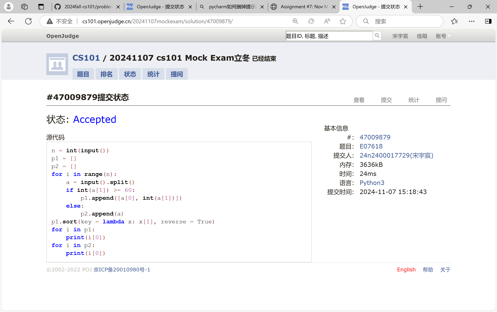
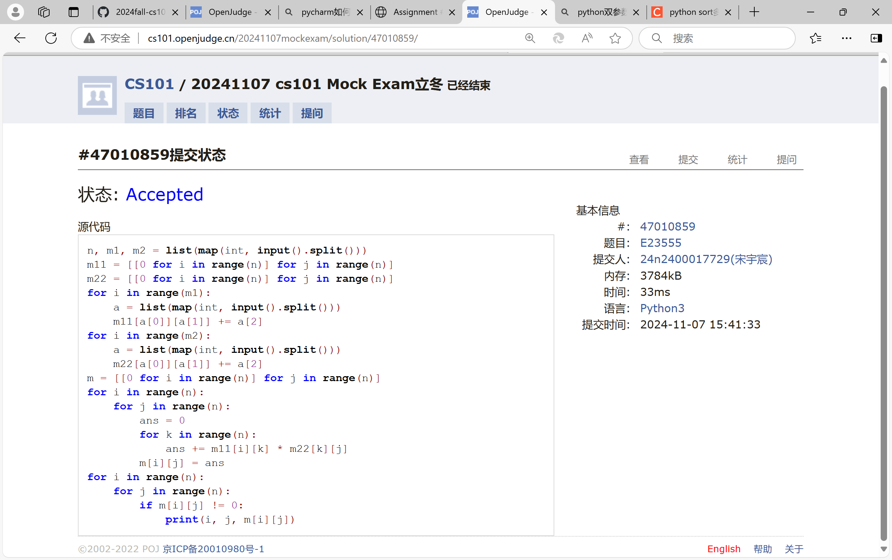
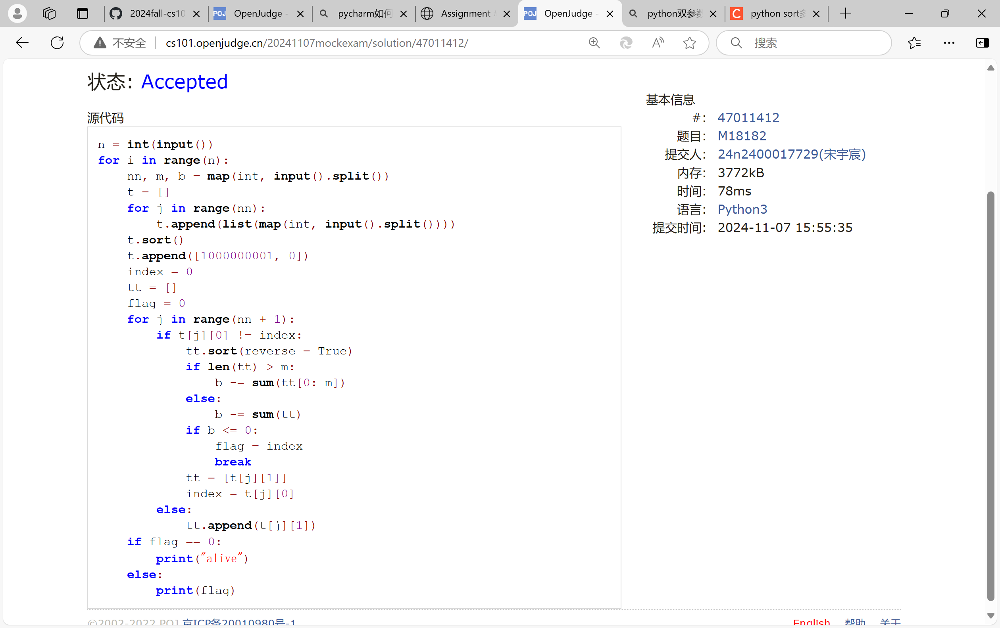
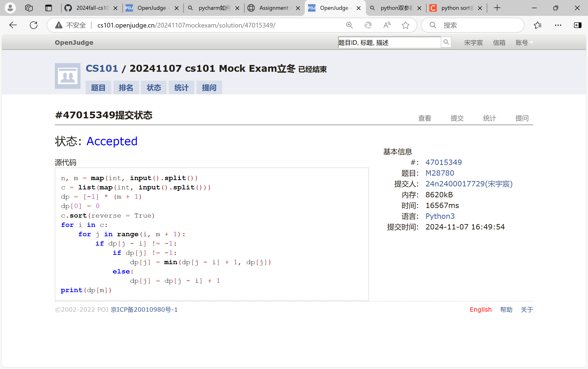
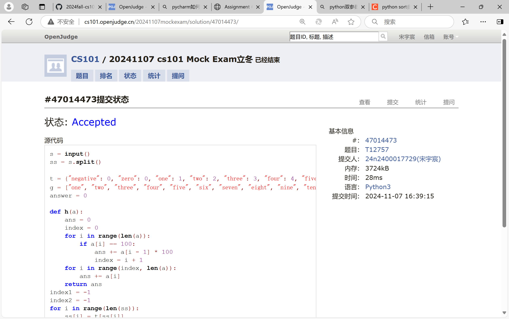
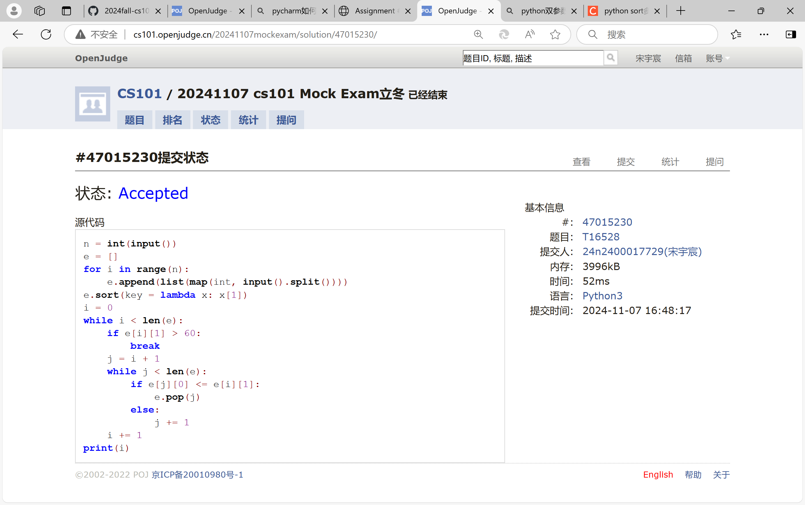

# Assignment #7: Nov Mock Exam立冬

Updated 1646 GMT+8 Nov 7, 2024

2024 fall, Complied by <mark>宋宇宸 元培学院</mark>


**说明：**

1）⽉考： AC6<mark>（请改为同学的通过数）</mark> 。考试题⽬都在“题库（包括计概、数算题目）”⾥⾯，按照数字题号能找到，可以重新提交。作业中提交⾃⼰最满意版本的代码和截图。

2）请把每个题目解题思路（可选），源码Python, 或者C++（已经在Codeforces/Openjudge上AC），截图（包含Accepted），填写到下面作业模版中（推荐使用 typora https://typoraio.cn ，或者用word）。AC 或者没有AC，都请标上每个题目大致花费时间。

3）提交时候先提交pdf文件，再把md或者doc文件上传到右侧“作业评论”。Canvas需要有同学清晰头像、提交文件有pdf、"作业评论"区有上传的md或者doc附件。

4）如果不能在截止前提交作业，请写明原因。


## 1. 题目

### E07618: 病人排队

sorttings, http://cs101.openjudge.cn/practice/07618/

思路：


代码：

```python
n = int(input())
p1 = []
p2 = []
for i in range(n):
    a = input().split()
    if int(a[1]) >= 60:
        p1.append([a[0], int(a[1])])
    else:
        p2.append(a)
p1.sort(key = lambda x: x[1], reverse = True)
for i in p1:
    print(i[0])
for i in p2:
    print(i[0])
```


代码运行截图 <mark>（至少包含有"Accepted"）</mark>



### E23555: 节省存储的矩阵乘法

implementation, matrices, http://cs101.openjudge.cn/practice/23555/

思路：


代码：

```python
n, m1, m2 = list(map(int, input().split()))
m11 = [[0 for i in range(n)] for j in range(n)]
m22 = [[0 for i in range(n)] for j in range(n)]
for i in range(m1):
    a = list(map(int, input().split()))
    m11[a[0]][a[1]] += a[2]
for i in range(m2):
    a = list(map(int, input().split()))
    m22[a[0]][a[1]] += a[2]
m = [[0 for i in range(n)] for j in range(n)]
for i in range(n):
    for j in range(n):
        ans = 0
        for k in range(n):
            ans += m11[i][k] * m22[k][j]
        m[i][j] = ans
for i in range(n):
    for j in range(n):
        if m[i][j] != 0:
            print(i, j, m[i][j])
```


代码运行截图 ==（至少包含有"Accepted"）==



### M18182: 打怪兽 

implementation/sortings/data structures, http://cs101.openjudge.cn/practice/18182/

思路：


代码：

```python
n = int(input())
for i in range(n):
    nn, m, b = map(int, input().split())
    t = []
    for j in range(nn):
        t.append(list(map(int, input().split())))
    t.sort()
    t.append([1000000001, 0])
    index = 0
    tt = []
    flag = 0
    for j in range(nn + 1):
        if t[j][0] != index:
            tt.sort(reverse = True)
            if len(tt) > m:
                b -= sum(tt[0: m])
            else:
                b -= sum(tt)
            if b <= 0:
                flag = index
                break
            tt = [t[j][1]]
            index = t[j][0]
        else:
            tt.append(t[j][1])
    if flag == 0:
        print("alive")
    else:
        print(flag)
```


代码运行截图 <mark>（至少包含有"Accepted"）</mark>



### M28780: 零钱兑换3

dp, http://cs101.openjudge.cn/practice/28780/

思路：


代码：

```python
n, m = map(int, input().split())
c = list(map(int, input().split()))
dp = [-1] * (m + 1)
dp[0] = 0
c.sort(reverse = True)
for i in c:
    for j in range(i, m + 1):
        if dp[j - i] != -1:
            if dp[j] != -1:
                dp[j] = min(dp[j - i] + 1, dp[j])
            else:
                dp[j] = dp[j - i] + 1
print(dp[m])
```


代码运行截图 <mark>（至少包含有"Accepted"）</mark>



### T12757: 阿尔法星人翻译官

implementation, http://cs101.openjudge.cn/practice/12757

思路：


代码：

```python
s = input()
ss = s.split()

t = {"negative": 0, "zero": 0, "one": 1, "two": 2, "three": 3, "four": 4, "five": 5, "six": 6, "seven": 7, "eight": 8, "nine": 9, "ten": 10, "eleven": 11, "twelve": 12, "thirteen": 13, "fourteen": 14, "fifteen": 15, "sixteen": 16, "seventeen": 17, "eighteen": 18, "nineteen": 19, "twenty": 20, "thirty":30, "forty": 40, "fifty": 50, "sixty": 60, "seventy": 70, "eighty": 80, "ninety": 90, "hundred": 100, "thousand": 1000, "million": 1000000}
g = ["one", "two", "three", "four", "five", "six", "seven", "eight", "nine", "ten"]
answer = 0

def h(a):
    ans = 0
    index = 0
    for i in range(len(a)):
        if a[i] == 100:
            ans += a[i - 1] * 100
            index = i + 1
    for i in range(index, len(a)):
        ans += a[i]
    return ans
index1 = -1
index2 = -1
for i in range(len(ss)):
    ss[i] = t[ss[i]]
    if ss[i] == 1000000:
        index1 = i
    if ss[i] == 1000:
        index2 = i
if index1 != -1:
    answer += 1000000 * h(ss[0: index1])
if index2 != -1:
    answer += 1000 * h(ss[index1 + 1: index2])
answer += h(ss[max(index1, index2) + 1:])
if ss[0] == 0:
    answer *= -1
print(answer)
```


代码运行截图 <mark>（至少包含有"Accepted"）</mark>



### T16528: 充实的寒假生活

greedy/dp, cs10117 Final Exam, http://cs101.openjudge.cn/practice/16528/

思路：


代码：

```python
n = int(input())
e = []
for i in range(n):
    e.append(list(map(int, input().split())))
e.sort(key = lambda x: x[1])
i = 0
while i < len(e):
    if e[i][1] > 60:
        break
    j = i + 1
    while j < len(e):
        if e[j][0] <= e[i][1]:
            e.pop(j)
        else:
            j += 1
    i += 1
print(i)
```


代码运行截图 <mark>（至少包含有"Accepted"）</mark>



## 2. 学习总结和收获

<mark>如果作业题目简单，有否额外练习题目，比如：OJ“计概2024fall每日选做”、CF、LeetCode、洛谷等网站题目。</mark>

第一次ak，感觉跟进每日一题有助于保持良好的状态


