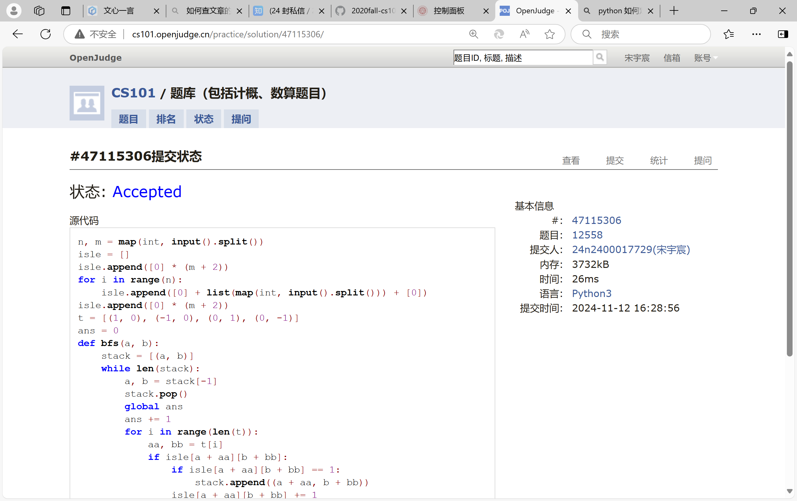
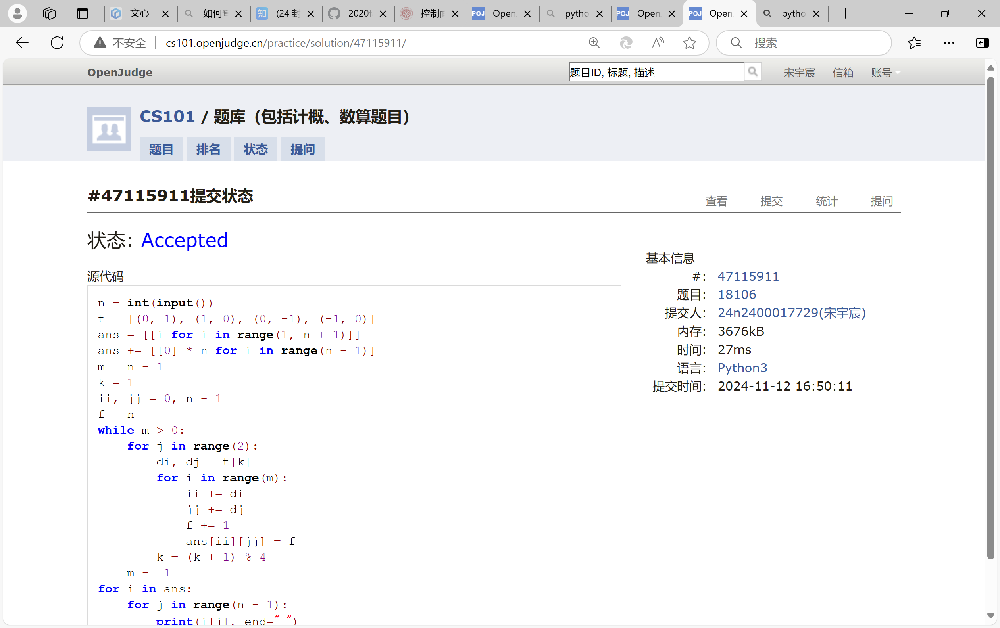
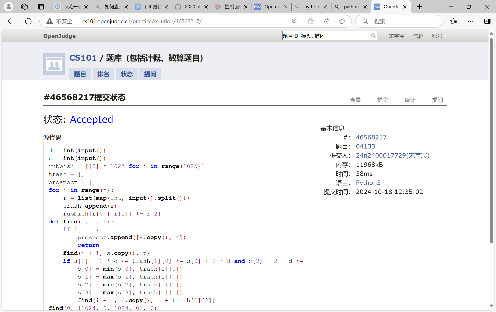
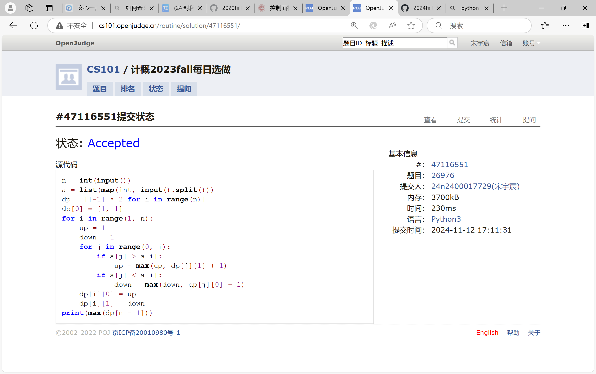
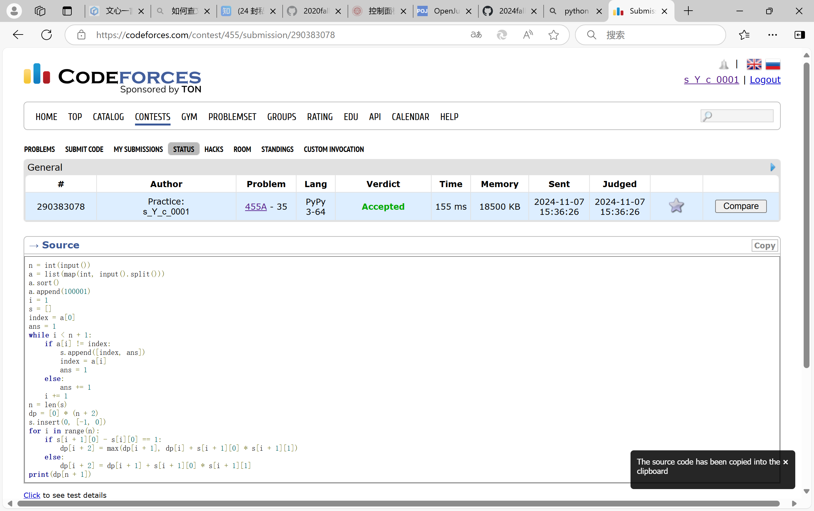
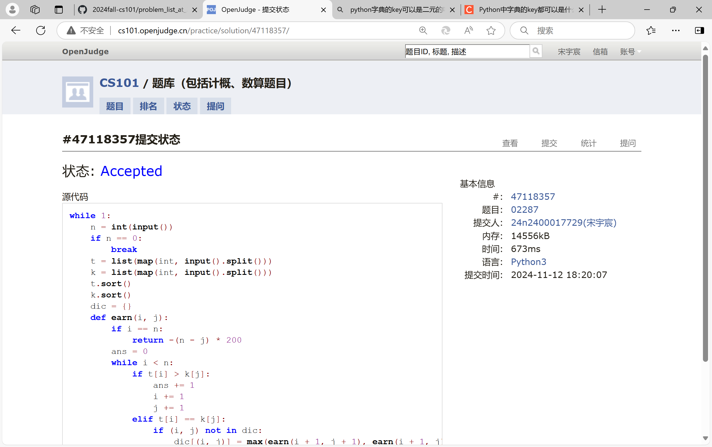

# Assignment #8: 田忌赛马来了

Updated 1021 GMT+8 Nov 12, 2024

2024 fall, Complied by <mark>宋宇宸 元培学院</mark>


**说明：**

1）请把每个题目解题思路（可选），源码Python, 或者C++（已经在Codeforces/Openjudge上AC），截图（包含Accepted），填写到下面作业模版中（推荐使用 typora https://typoraio.cn ，或者用word）。AC 或者没有AC，都请标上每个题目大致花费时间。

2）提交时候先提交pdf文件，再把md或者doc文件上传到右侧“作业评论”。Canvas需要有同学清晰头像、提交文件有pdf、"作业评论"区有上传的md或者doc附件。

3）如果不能在截止前提交作业，请写明原因。


## 1. 题目

### 12558: 岛屿周⻓

matices, http://cs101.openjudge.cn/practice/12558/ 

思路：


代码：

```python
n, m = map(int, input().split())
isle = []
isle.append([0] * (m + 2))
for i in range(n):
    isle.append([0] + list(map(int, input().split())) + [0])
isle.append([0] * (m + 2))
t = [(1, 0), (-1, 0), (0, 1), (0, -1)]
ans = 0
def bfs(a, b):
    stack = [(a, b)]
    while len(stack):
        a, b = stack[-1]
        stack.pop()
        global ans
        ans += 1
        for i in range(len(t)):
            aa, bb = t[i]
            if isle[a + aa][b + bb]:
                if isle[a + aa][b + bb] == 1:
                    stack.append((a + aa, b + bb))
                isle[a + aa][b + bb] += 1
flag = 0
for i in range(1, n + 1):
    for j in range(1, m + 1):
        if isle[i][j]:
            isle[i][j] += 1
            bfs(i, j)
            isle[i][j] -= 1
            flag = 1
            break
    if flag == 1:
        break
ans = ans * 5 - sum(map(sum, isle))
print(ans)
```


代码运行截图 <mark>（至少包含有"Accepted"）</mark>



### LeetCode54.螺旋矩阵

matrice, https://leetcode.cn/problems/spiral-matrix/

与OJ这个题目一样的 18106: 螺旋矩阵，http://cs101.openjudge.cn/practice/18106

思路：


代码：

```python
n = int(input())
t = [(0, 1), (1, 0), (0, -1), (-1, 0)]
ans = [[i for i in range(1, n + 1)]]
ans += [[0] * n for i in range(n - 1)]
m = n - 1
k = 1
ii, jj = 0, n - 1
f = n
while m > 0:
    for j in range(2):
        di, dj = t[k]
        for i in range(m):
            ii += di
            jj += dj
            f += 1
            ans[ii][jj] = f
        k = (k + 1) % 4
    m -= 1
for i in ans:
    for j in range(n - 1):
        print(i[j], end=" ")
    print(i[-1])
```


代码运行截图 ==（至少包含有"Accepted"）==



### 04133:垃圾炸弹

matrices, http://cs101.openjudge.cn/practice/04133/

思路：


代码：

```python
d = int(input())
n = int(input())
rubbish = [[0] * 1025 for i in range(1025)]
trash = []
prospect = []
for i in range(n):
    r = list(map(int, input().split()))
    trash.append(r)
    rubbish[r[0]][r[1]] += r[2]
def find(i, s, t):
    if i == n:
        prospect.append([s.copy(), t])
        return
    find(i + 1, s.copy(), t)
    if s[1] - 2 * d <= trash[i][0] <= s[0] + 2 * d and s[3] - 2 * d <= trash[i][1] <= s[2] + 2 * d:
        s[0] = min(s[0], trash[i][0])
        s[1] = max(s[1], trash[i][0])
        s[2] = min(s[2], trash[i][1])
        s[3] = max(s[3], trash[i][1])
        find(i + 1, s.copy(), t + trash[i][2])
find(0, [1024, 0, 1024, 0], 0)
prospect.sort(reverse = True, key = lambda x: x[1])
ans = 0
i = 0
while prospect[i][1] == prospect[0][1]:
    ans += (2 * d - max(d, prospect[i][0][1]) + min(1024 - d, prospect[i][0][0]) + 1) * (2 * d + min(1024 - d, prospect[i][0][2]) - max(d, prospect[i][0][3]) + 1)
    i += 1
print(ans, prospect[0][1])
```


代码运行截图 <mark>（至少包含有"Accepted"）</mark>



### LeetCode376.摆动序列

greedy, dp, https://leetcode.cn/problems/wiggle-subsequence/

与OJ这个题目一样的，26976:摆动序列, http://cs101.openjudge.cn/routine/26976/

思路：


代码：

```python
n = int(input())
a = list(map(int, input().split()))
dp = [[-1] * 2 for i in range(n)]
dp[0] = [1, 1]
for i in range(1, n):
    up = 1
    down = 1
    for j in range(0, i):
        if a[j] > a[i]:
            up = max(up, dp[j][1] + 1)
        if a[j] < a[i]:
            down = max(down, dp[j][0] + 1)
    dp[i][0] = up
    dp[i][1] = down
print(max(dp[n - 1]))
```


代码运行截图 <mark>（至少包含有"Accepted"）</mark>



### CF455A: Boredom

dp, 1500, https://codeforces.com/contest/455/problem/A

思路：


代码：

```python
n = int(input())
a = list(map(int, input().split()))
a.sort()
a.append(100001)
i = 1
s = []
index = a[0]
ans = 1
while i < n + 1:
    if a[i] != index:
        s.append([index, ans])
        index = a[i]
        ans = 1
    else:
        ans += 1
    i += 1
n = len(s)
dp = [0] * (n + 2)
s.insert(0, [-1, 0])
for i in range(n):
    if s[i + 1][0] - s[i][0] == 1:
        dp[i + 2] = max(dp[i + 1], dp[i] + s[i + 1][0] * s[i + 1][1])
    else:
        dp[i + 2] = dp[i + 1] + s[i + 1][0] * s[i + 1][1]
print(dp[n + 1])
```


代码运行截图 <mark>（至少包含有"Accepted"）</mark>



### 02287: Tian Ji -- The Horse Racing

greedy, dfs http://cs101.openjudge.cn/practice/02287

思路：


代码：

```python
while 1:
    n = int(input())
    if n == 0:
        break
    t = list(map(int, input().split()))
    k = list(map(int, input().split()))
    t.sort()
    k.sort()
    dic = {}
    def earn(i, j):
        if i == n:
            return -(n - j) * 200
        ans = 0
        while i < n:
            if t[i] > k[j]:
                ans += 1
                i += 1
                j += 1
            elif t[i] == k[j]:
                if (i, j) not in dic:
                    dic[(i, j)] = max(earn(i + 1, j + 1), earn(i + 1, j))
                return dic[i, j] + ans * 200
            else:
                i += 1
        return ans * 200 - (n - j) * 200
    print(earn(0, 0))
```


代码运行截图 <mark>（至少包含有"Accepted"）</mark>



## 2. 学习总结和收获

<mark>如果作业题目简单，有否额外练习题目，比如：OJ“计概2024fall每日选做”、CF、LeetCode、洛谷等网站题目。</mark>

为什么这次作业题有一半都不是每日选做啊，把没做的题做完花了好长时间qwq


