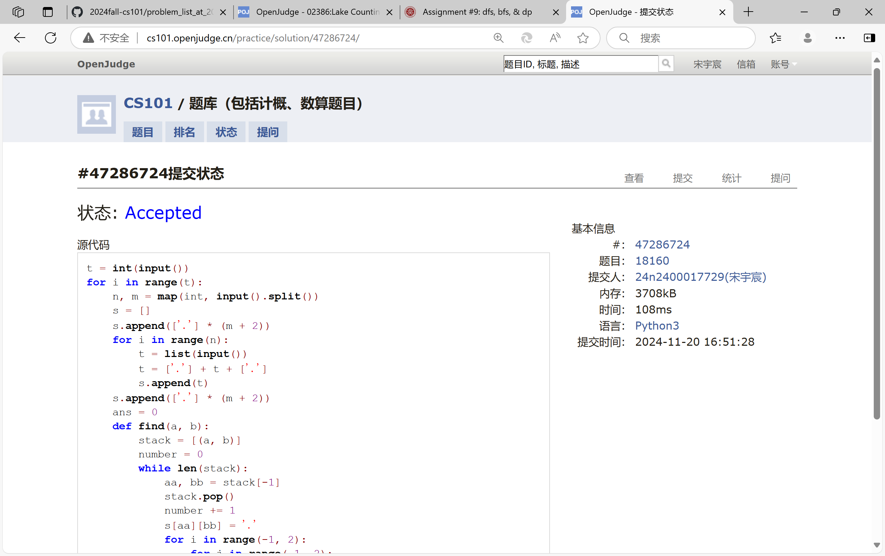
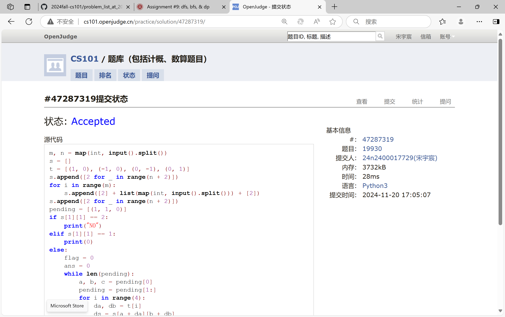
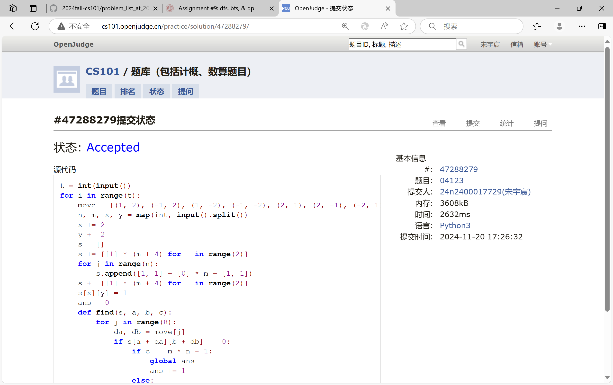
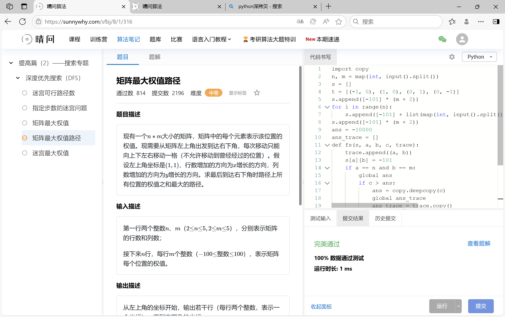
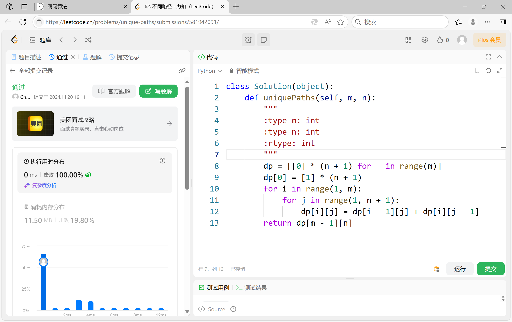
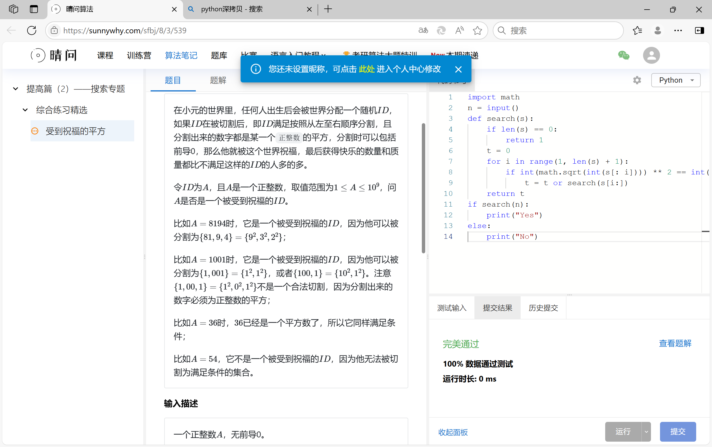

# Assignment #9: dfs, bfs, & dp

Updated 2107 GMT+8 Nov 19, 2024

2024 fall, Complied by <mark>宋宇宸 元培学院</mark>


**说明：**

1）请把每个题目解题思路（可选），源码Python, 或者C++（已经在Codeforces/Openjudge上AC），截图（包含Accepted），填写到下面作业模版中（推荐使用 typora https://typoraio.cn ，或者用word）。AC 或者没有AC，都请标上每个题目大致花费时间。

2）提交时候先提交pdf文件，再把md或者doc文件上传到右侧“作业评论”。Canvas需要有同学清晰头像、提交文件有pdf、"作业评论"区有上传的md或者doc附件。

3）如果不能在截止前提交作业，请写明原因。


## 1. 题目

### 18160: 最大连通域面积

dfs similar, http://cs101.openjudge.cn/practice/18160

思路：


代码：

```python
t = int(input())
for i in range(t):
    n, m = map(int, input().split())
    s = []
    s.append(['.'] * (m + 2))
    for i in range(n):
        t = list(input())
        t = ['.'] + t + ['.']
        s.append(t)
    s.append(['.'] * (m + 2))
    ans = 0
    def find(a, b):
        stack = [(a, b)]
        number = 0
        while len(stack):
            aa, bb = stack[-1]
            stack.pop()
            number += 1
            s[aa][bb] = '.'
            for i in range(-1, 2):
                for j in range(-1, 2):
                    if s[aa + i][bb + j] == "W":
                        stack.append((aa + i, bb + j))
                        s[aa + i][bb + j] = '.'
        return number
    for i in range(1, n + 1):
        for j in range(1, m + 1):
            if s[i][j] == "W":
                ans = max(ans, find(i, j))
    print(ans)
```


代码运行截图 <mark>（至少包含有"Accepted"）</mark>



### 19930: 寻宝

bfs, http://cs101.openjudge.cn/practice/19930

思路：


代码：

```python
m, n = map(int, input().split())
s = []
t = [(1, 0), (-1, 0), (0, -1), (0, 1)]
s.append([2 for _ in range(n + 2)])
for i in range(m):
    s.append([2] + list(map(int, input().split())) + [2])
s.append([2 for _ in range(n + 2)])
pending = [(1, 1, 0)]
if s[1][1] == 2:
    print("NO")
elif s[1][1] == 1:
    print(0)
else:
    flag = 0
    ans = 0
    while len(pending):
        a, b, c = pending[0]
        pending = pending[1:]
        for i in range(4):
            da, db = t[i]
            ds = s[a + da][b + db]
            if ds == 0:
                pending.append((a + da, b + db, c + 1))
                s[a + da][b + db] = 2
            elif ds == 1:
                flag = 1
                ans = c + 1
                break
        if flag == 1:
            break
    if flag == 1:
        print(ans)
    else:
        print("NO")
```


代码运行截图 ==（至少包含有"Accepted"）==



### 04123: 马走日

dfs, http://cs101.openjudge.cn/practice/04123

思路：


代码：

```python
t = int(input())
for i in range(t):
    move = [(1, 2), (-1, 2), (1, -2), (-1, -2), (2, 1), (2, -1), (-2, 1), (-2, -1)]
    n, m, x, y = map(int, input().split())
    x += 2
    y += 2
    s = []
    s += [[1] * (m + 4) for _ in range(2)]
    for j in range(n):
        s.append([1, 1] + [0] * m + [1, 1])
    s += [[1] * (m + 4) for _ in range(2)]
    s[x][y] = 1
    ans = 0
    def find(s, a, b, c):
        for j in range(8):
            da, db = move[j]
            if s[a + da][b + db] == 0:
                if c == m * n - 1:
                    global ans
                    ans += 1
                else:
                    s[a + da][b + db] = 1
                    find(s.copy(), a + da, b + db, c + 1)
                    s[a + da][b + db] = 0
    find(s.copy(), x, y, 1)
    print(ans)
```


代码运行截图 <mark>（至少包含有"Accepted"）</mark>



### sy316: 矩阵最大权值路径

dfs, https://sunnywhy.com/sfbj/8/1/316

思路：


代码：

```python
import copy
n, m = map(int, input().split())
s = []
t = [(-1, 0), (1, 0), (0, 1), (0, -1)]
s.append([-101] * (m + 2))
for i in range(n):
    s.append([-101] + list(map(int, input().split())) + [-101])
s.append([-101] * (m + 2))
ans = -10000
ans_trace = []
def fs(s, a, b, c, trace):
    trace.append((a, b))
    s[a][b] = -101
    if a == n and b == m:
        global ans
        if c > ans:
            ans = copy.deepcopy(c)
            global ans_trace
            ans_trace = trace.copy()
    for i in range(4):
        da, db = t[i]
        if s[a + da][b + db] != -101:
            fs(copy.deepcopy(s), a + da, b + db, c + s[a + da][b + db], copy.deepcopy(trace))
fs(s.copy(), 1, 1, s[1][1], [])
for i, j in ans_trace:
    print(i, j)
```


代码运行截图 <mark>（至少包含有"Accepted"）</mark>



### LeetCode62.不同路径

dp, https://leetcode.cn/problems/unique-paths/

思路：


代码：

```python
class Solution(object):
    def uniquePaths(self, m, n):
        """
        :type m: int
        :type n: int
        :rtype: int
        """
        dp = [[0] * (n + 1) for _ in range(m)]
        dp[0] = [1] * (n + 1)
        for i in range(1, m):
            for j in range(1, n + 1):
                dp[i][j] = dp[i - 1][j] + dp[i][j - 1]
        return dp[m - 1][n]
```


代码运行截图 <mark>（至少包含有"Accepted"）</mark>



### sy358: 受到祝福的平方

dfs, dp, https://sunnywhy.com/sfbj/8/3/539

思路：


代码：

```python
import math
n = input()
def search(s):
    if len(s) == 0:
        return 1
    t = 0
    for i in range(1, len(s) + 1):
        if int(math.sqrt(int(s[: i]))) ** 2 == int(s[: i]) and int(s[: i]) != 0:
            t = t or search(s[i:])
    return t
if search(n):
    print("Yes")
else:
    print("No")
```


代码运行截图 <mark>（至少包含有"Accepted"）</mark>



## 2. 学习总结和收获

<mark>如果作业题目简单，有否额外练习题目，比如：OJ“计概2024fall每日选做”、CF、LeetCode、洛谷等网站题目。</mark>

感觉搜索还需要多多练习


