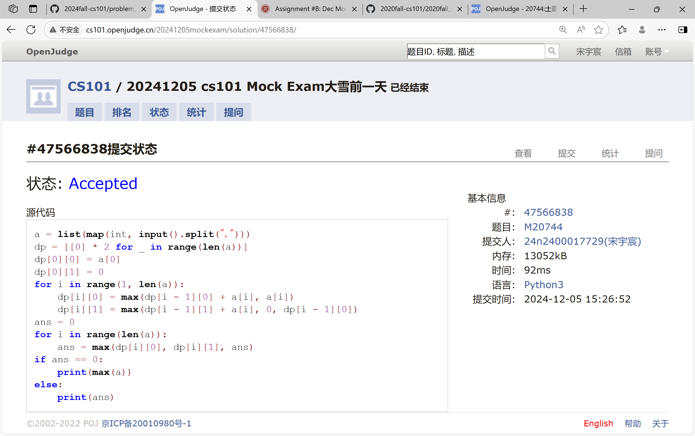

# Assignment #B: Dec Mock Exam大雪前一天

Updated 1649 GMT+8 Dec 5, 2024

2024 fall, Complied by <mark>宋宇宸 元培学院</mark>


**说明：**

1）⽉考： AC2<mark>（请改为同学的通过数）</mark> 。考试题⽬都在“题库（包括计概、数算题目）”⾥⾯，按照数字题号能找到，可以重新提交。作业中提交⾃⼰最满意版本的代码和截图。

2）请把每个题目解题思路（可选），源码Python, 或者C++（已经在Codeforces/Openjudge上AC），截图（包含Accepted），填写到下面作业模版中（推荐使用 typora https://typoraio.cn ，或者用word）。AC 或者没有AC，都请标上每个题目大致花费时间。

3）提交时候先提交pdf文件，再把md或者doc文件上传到右侧“作业评论”。Canvas需要有同学清晰头像、提交文件有pdf、"作业评论"区有上传的md或者doc附件。

4）如果不能在截止前提交作业，请写明原因。


## 1. 题目

### E22548: 机智的股民老张

http://cs101.openjudge.cn/practice/22548/

思路：


代码：

```python
a = list(map(int, input().split()))
mi = [100001] * (len(a))
ma = [-1] * (len(a))
mi[0] = a[0]
ma[len(a) - 1] = a[-1]
for i in range(1, len(a)):
    mi[i] = min(mi[i - 1], a[i])
for i in range(len(a) - 2, -1, -1):
    ma[i] = max(ma[i + 1], a[i])
ans = -1
for i in range(len(a)):
    ans = max(ans, ma[i] - mi[i])
print(ans)
```


代码运行截图 <mark>（至少包含有"Accepted"）</mark>


### M28701: 炸鸡排

greedy, http://cs101.openjudge.cn/practice/28701/

思路：


代码：

```python
n, k = map(int, input().split())
t = list(map(int, input().split()))
t.sort()
ans = 0
t.insert(0, 0)
t.append(1000000001)
k += 1
t0 = t[len(t) - k]
index1 = 0
index2 = 0
for i in range(len(t) - k - 1, -1, -1):
    if t[i] != t0:
        index1 = len(t) - k - 1 - i
        break
for i in range(len(t) - k + 1, len(t), 1):
    if t[i] != t0:
        index2 = i - (len(t) - k + 1)
        break
while 1:
    p = (1 + index2) / (1 + index1 + index2)
    if p == 1 or (t0 - t[len(t) - k - index1 - 1]) / p < (t[len(t) - k + index2 + 1] - t0) / (1 - p):
        dt = (t0 - t[len(t) - k - index1 - 1]) / p
        ans += dt
        t[len(t) - k - index1: len(t) - k + index2 + 1] = [t[len(t) - k - index1 - 1]] * (1 + index1 + index2)
        for i in range(len(t) - k + index2 + 1, len(t)):
            t[i] -= dt
        if len(t) - k - index1 == 1:
            break
        t0 = t[len(t) - k]
        for i in range(len(t) - k - index1 - 1, -1, -1):
            if t[i] != t0:
                index1 = len(t) - k - 1 - i
                break
    else:
        dt = (t[len(t) - k + index2 + 1] - t0) / (1 - p)
        ans += dt
        t[len(t) - k - index1: len(t) - k + index2 + 1] = [t0 - (t[len(t) - k + index2 + 1] - t0) * p / (1 - p)] * (1 + index1 + index2)
        for i in range(len(t) - k + index2 + 1, len(t)):
            t[i] -= dt
        t0 = t[len(t) - k]
        for i in range(len(t) - k + index2 + 1, len(t), 1):
            if t[i] != t0:
                index2 = i - (len(t) - k + 1)
                break
print(f"{ans:.3f}")
```


代码运行截图 ==（至少包含有"Accepted"）==


### M20744: 土豪购物

dp, http://cs101.openjudge.cn/practice/20744/

思路：


代码：

```python
a = list(map(int, input().split(",")))
dp = [[0] * 2 for _ in range(len(a))]
dp[0][0] = a[0]
dp[0][1] = 0
for i in range(1, len(a)):
    dp[i][0] = max(dp[i - 1][0] + a[i], a[i])
    dp[i][1] = max(dp[i - 1][1] + a[i], 0, dp[i - 1][0])
ans = 0
for i in range(len(a)):
    ans = max(dp[i][0], dp[i][1], ans)
if ans == 0:
    print(max(a))
else:
    print(ans)
```


代码运行截图 <mark>（至少包含有"Accepted"）</mark>



### T25561: 2022决战双十一

brute force, dfs, http://cs101.openjudge.cn/practice/25561/

思路：


代码：

```python
import copy
n, m = map(int, input().split())
g = []
for i in range(n):
    gg = []
    a = input().split()
    for j in a:
        t = list(map(int, j.split(":")))
        t[0] -= 1
        gg.append(t)
    g.append(gg)
c = []
for i in range(m):
    cc = []
    a = input().split()
    for j in a:
        cc.append(list(map(int, j.split("-"))))
    c.append(cc)
ans = 10000000
def dfs(index, choice):
    if index == n:
        global ans
        t = sum(choice)
        t -= (t // 300) * 50
        for i in range(m):
            discount = 0
            for j in c[i]:
                if j[0] <= choice[i]:
                    discount = max(discount, j[1])
            t -= discount
        ans = min(ans, t)
        return
    for i in g[index]:
        choice[i[0]] += i[1]
        dfs(index + 1, copy.deepcopy(choice))
        choice[i[0]] -= i[1]
dfs(0, copy.deepcopy([0] * m))
print(ans)
```


代码运行截图 <mark>（至少包含有"Accepted"）</mark>


### T20741: 两座孤岛最短距离

dfs, bfs, http://cs101.openjudge.cn/practice/20741/

思路：


代码：

```python
n = int(input())
s = []
for i in range(n):
    s.append(list("2" + input() + "2"))
l = len(s[0]) - 2
s.insert(0, ["2"] * (l + 2))
s.append(["2"] * (l + 2))
move = [(1, 0), (-1, 0), (0, 1), (0, -1)]
pending1 = []
pending2 = []
check = [[0] * (l + 2) for _ in range(n + 2)]
f = 0
for i in range(1, n + 1):
    for j in range(1, l + 1):
        if s[i][j] == "1":
            pending1.append((i, j))
            while pending1:
                a, b = pending1[0]
                check[a][b] = 1
                pending1 = pending1[1:]
                for da, db in move:
                    if not check[a + da][b + db]:
                        if s[a + da][b + db] == "0":
                            check[a + da][b + db] = 1
                            pending2.append((a + da, b + db, 1))
                        if s[a + da][b + db] == "1":
                            check[a + da][b + db] = 1
                            pending1.append((a + da, b + db))
            f = 1
            break
    if f == 1:
        break
flag = 0
ans = 0
while pending2:
    a, b, c = pending2[0]
    check[a][b] = 1
    pending2 = pending2[1:]
    for da, db in move:
        if not check[a + da][b + db]:
            if s[a + da][b + db] == "0":
                check[a + da][b + db] = 1
                pending2.append((a + da, b + db, c + 1))
            if s[a + da][b + db] == "1":
                ans = c
                flag = 1
                break
    if flag == 1:
        break
print(ans)
```


代码运行截图 <mark>（至少包含有"Accepted"）</mark>


### T28776: 国王游戏

greedy, http://cs101.openjudge.cn/practice/28776

思路：


代码：

```python
n = int(input())
k = list(map(int, input().split()))
m = []
for i in range(n):
    t = list(map(int, input().split()))
    m.append(t + [t[0] * t[1]])
m.sort(key = lambda x: x[2])
ans = 0
t = k[0]
for i in range(n):
    ans = max(ans, t // m[i][1])
    t *= m[i][0]
print(ans)
```


代码运行截图 <mark>（至少包含有"Accepted"）</mark>


## 2. 学习总结和收获

<mark>如果作业题目简单，有否额外练习题目，比如：OJ“计概2024fall每日选做”、CF、LeetCode、洛谷等网站题目。</mark>

这次月考让我注意到了很多细节上的问题，继续加油吧


