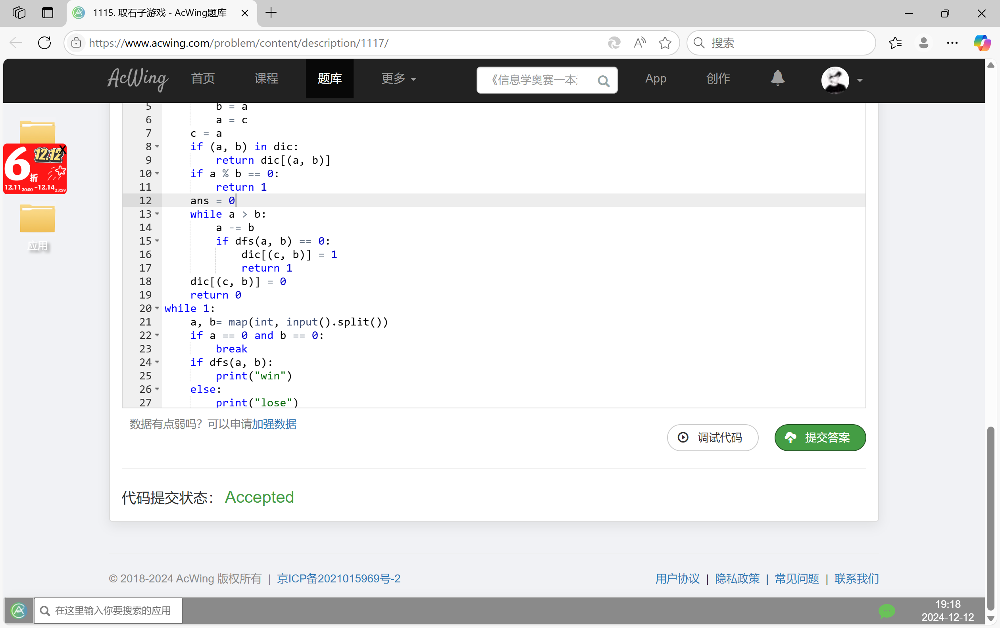

# Assignment #C: 五味杂陈 

Updated 1148 GMT+8 Dec 10, 2024

2024 fall, Complied by <mark>宋宇宸 元培学院</mark>


**说明：**

1）请把每个题目解题思路（可选），源码Python, 或者C++（已经在Codeforces/Openjudge上AC），截图（包含Accepted），填写到下面作业模版中（推荐使用 typora https://typoraio.cn ，或者用word）。AC 或者没有AC，都请标上每个题目大致花费时间。

2）提交时候先提交pdf文件，再把md或者doc文件上传到右侧“作业评论”。Canvas需要有同学清晰头像、提交文件有pdf、"作业评论"区有上传的md或者doc附件。

3）如果不能在截止前提交作业，请写明原因。


## 1. 题目

### 1115. 取石子游戏

dfs, https://www.acwing.com/problem/content/description/1117/

思路：


代码：

```python
dic = {}
def dfs(a, b):
    if b > a:
        c = b
        b = a
        a = c
    c = a
    if (a, b) in dic:
        return dic[(a, b)]
    if a % b == 0:
        return 1
    ans = 0
    while a > b:
        a -= b
        if dfs(a, b) == 0:
            dic[(c, b)] = 1
            return 1
    dic[(c, b)] = 0
    return 0
while 1:
    a, b= map(int, input().split())
    if a == 0 and b == 0:
        break
    if dfs(a, b):
        print("win")
    else:
        print("lose")
```


代码运行截图 <mark>（至少包含有"Accepted"）</mark>



### 25570: 洋葱

Matrices, http://cs101.openjudge.cn/practice/25570

思路：


代码：

```python
n = int(input())
s = []
for i in range(n):
    s.append(list(map(int, input().split())))
ans = [0] * ((n + 1) // 2)
for i in range((n + 1) // 2):
    ans[i] += sum(s[i][i: n - i])
for i in range(n // 2):
    ans[i] += sum(s[n - i - 1][i: n - i])
for i in range(n // 2):
    for j in range(i + 1, n - i - 1):
        ans[i] += s[j][i] + s[j][n - 1 - i]
print(max(ans))
```


代码运行截图 ==（至少包含有"Accepted"）==


### 1526C1. Potions(Easy Version)

greedy, dp, data structures, brute force, *1500, https://codeforces.com/problemset/problem/1526/C1

思路：


代码：

```python
n = int(input())
a = list(map(int, input().split()))
dp = [[-float("inf")] * (n + 1) for _ in range(n + 1)]
for i in range(n + 1):
    dp[i][0] = 0
def find():
    for i in range(1, n + 1):
        for j in range(1, i + 1):
            if dp[i - 1][j - 1] + a[i - 1] >= 0:
                dp[i][j] = max(dp[i - 1][j], dp[i - 1][j - 1] + a[i - 1])
            else:
                dp[i][j] = dp[i - 1][j]
    for i in range(n, -1, -1):
        if dp[n][i] >= 0:
            return i
print(find())
```


代码运行截图 <mark>（至少包含有"Accepted"）</mark>


### 22067: 快速堆猪

辅助栈，http://cs101.openjudge.cn/practice/22067/

思路：


代码：

```python
m = []
s = []
while 1:
    try:
        a = input().split()
        if a[0] == "pop" and s:
            s.pop()
            m.pop()
        if a[0] == "min" and s:
            print(m[-1])
        if a[0] == "push":
            s.append(int(a[1]))
            if m:
                m.append(min(m[-1], int(a[1])))
            else:
                m.append(int(a[1]))
    except EOFError:
        break
```


代码运行截图 <mark>（至少包含有"Accepted"）</mark>


### 20106: 走山路

Dijkstra, http://cs101.openjudge.cn/practice/20106/

思路：


代码：

```python
m, n, p = map(int, input().split())
s = []
s.append(["#"] * (n + 2))
for i in range(m):
    s.append(["#"] + input().split() + ["#"])
s.append(["#"] * (n + 2))
inf = float("inf")
def find(a, x, l, r):
    if r - l == 1:
        if a[l][2] > x:
            return l - 1
        return l
    m = (l + r) // 2
    if a[m][2] > x:
        return find(a.copy(), x, l, m)
    return find(a.copy(), x, m, r)
def combine(a, b):
    b.sort(key = lambda x: x[2])
    index = 0
    if not len(a):
        return b
    for i in b:
        x = find(a.copy(), i[2], index, len(a))
        a.insert(x + 1, i)
    return a
def dijkstra(x1, y1, x2, y2):
    t = [[inf] * (n + 2) for _ in range(m + 2)]
    check = [[0] * (n + 2) for _ in range(m + 2)]
    if s[x1][y1] != "#":
        t[x1][y1] = 0
        check[x1][y1] = 1
    else:
        return inf
    move = [(0, 1), (0, -1), (1, 0), (-1, 0)]
    p = [[x1, y1, 0]]
    while len(p):
        a = p[0][0]
        b = p[0][1]
        h1 = int(s[a][b])
        p = p[1:]
        pp = []
        for i, j in move:
            if s[a + i][b + j] != "#":
                h2 = int(s[a + i][b + j])
                dh = abs(h1 - h2)
                if t[a + i][b + j] > t[a][b] + dh:
                    t[a + i][b + j] = t[a][b] + dh
                    pp.append([a + i, b + j, t[a][b] + dh])
        p = combine(p, pp)
    return t[x2][y2]
for i in range(p):
    x1, y1, x2, y2 = map(int, input().split())
    ans = dijkstra(x1 + 1, y1 + 1, x2 + 1, y2 + 1)
    if ans == inf:
        print("NO")
    else:
        print(ans)
```


代码运行截图 <mark>（至少包含有"Accepted"）</mark>


### 04129: 变换的迷宫

bfs, http://cs101.openjudge.cn/practice/04129/

思路：


代码：

```python
t = int(input())
for i in range(t):
    r, c, k = map(int, input().split())
    s = [list("1" * (c + 2))]
    begin = 0
    for j in range(r):
        a = "1" + input() + "1"
        if "S" in a:
            begin = (j + 1, a.find("S"), 0)
        s.append(list(a))
    s.append(list("1" * (c + 2)))
    pending = [begin]
    move = [(1, 0), (-1, 0), (0, 1), (0, -1)]
    flag = 0
    ans = 0
    check = [[[1] * (c + 2) for _ in range(r + 2)] for _ in range(k)]
    while pending:
        a, b, c = pending[0]
        pending = pending[1:]
        f = 0
        if (c + 1) % k == 0:
            f = 1
        check[c % k][a][b] = 0
        for da, db in move:
            if (s[a + da][b + db] == "." or s[a + da][b + db] == "S") and check[(c + 1) % k][a + da][b + db]:
                pending.append((a + da, b + db, c + 1))
                check[(c + 1) % k][a + da][b + db] = 0
            if s[a + da][b + db] == "#" and f and check[(c + 1) % k][a + da][b + db]:
                pending.append((a + da, b + db, c + 1))
                check[(c + 1) % k][a + da][b + db] = 0
            if s[a + da][b + db] == "E":
                flag = 1
                ans = c + 1
                break
        if flag == 1:
            break
    if ans == 0:
        print("Oop!")
    else:
        print(ans)
```


代码运行截图 <mark>（至少包含有"Accepted"）</mark>


## 2. 学习总结和收获

<mark>如果作业题目简单，有否额外练习题目，比如：OJ“计概2024fall每日选做”、CF、LeetCode、洛谷等网站题目。</mark>

要考期末考了，贪心和dp特别慌怎么办啊啊啊


