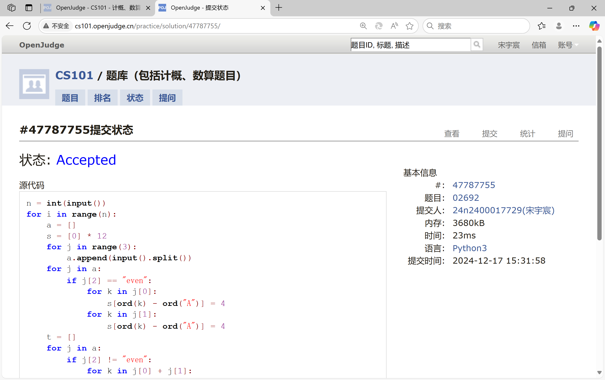
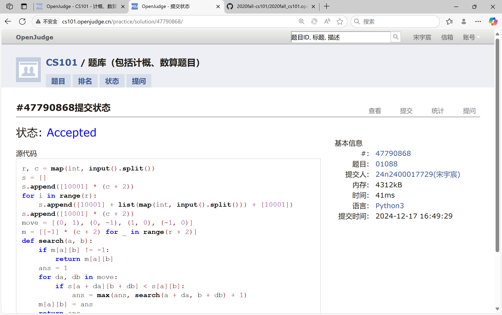
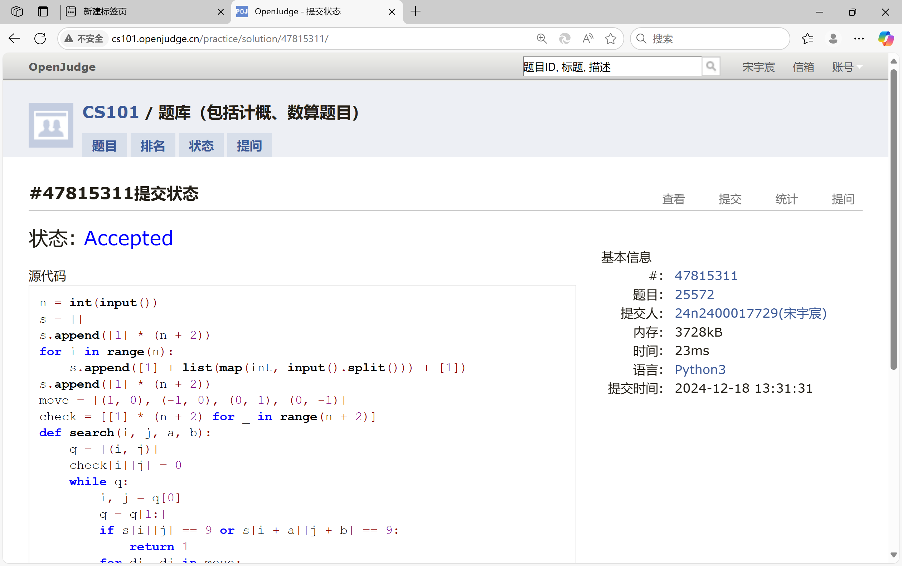
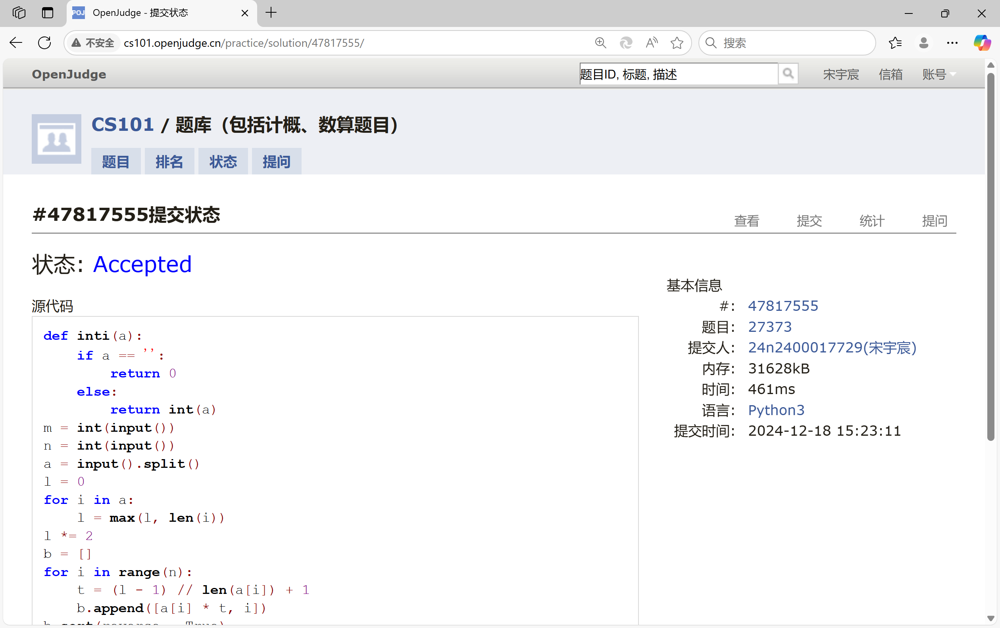
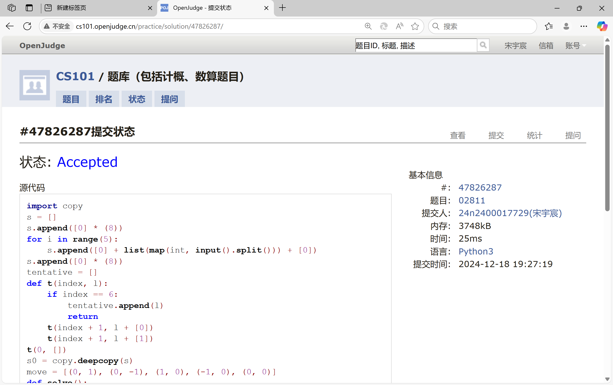
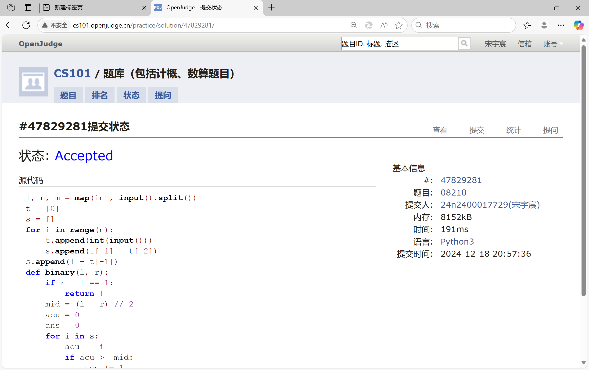

# Assignment #D: 十全十美 

Updated 1254 GMT+8 Dec 17, 2024

2024 fall, Complied by <mark>宋宇宸 元培学院</mark>


**说明：**

1）请把每个题目解题思路（可选），源码Python, 或者C++（已经在Codeforces/Openjudge上AC），截图（包含Accepted），填写到下面作业模版中（推荐使用 typora https://typoraio.cn ，或者用word）。AC 或者没有AC，都请标上每个题目大致花费时间。

2）提交时候先提交pdf文件，再把md或者doc文件上传到右侧“作业评论”。Canvas需要有同学清晰头像、提交文件有pdf、"作业评论"区有上传的md或者doc附件。

3）如果不能在截止前提交作业，请写明原因。


## 1. 题目

### 02692: 假币问题

brute force, http://cs101.openjudge.cn/practice/02692

思路：


代码：

```python
n = int(input())
for i in range(n):
    a = []
    s = [0] * 12
    for j in range(3):
        a.append(input().split())
    for j in a:
        if j[2] == "even":
            for k in j[0]:
                s[ord(k) - ord("A")] = 4
            for k in j[1]:
                s[ord(k) - ord("A")] = 4
    t = []
    for j in a:
        if j[2] != "even":
            for k in j[0] + j[1]:
                if s[ord(k) - ord("A")] != 4:
                    ans = 1
                    if j[2] == "up":
                        ans *= -1
                    if j[0].find(k) == -1:
                        ans *= -1
                    s[ord(k) - ord("A")] += ans
    m = 0
    index = 0
    for j in range(12):
        if 4 > abs(s[j]) > m:
            m = abs(s[j])
            index = j
    ans = chr(index + ord("A"))
    if s[index] > 0:
        print(f"{ans} is the counterfeit coin and it is light.")
    else:
        print(f"{ans} is the counterfeit coin and it is heavy.")
```


代码运行截图 <mark>（至少包含有"Accepted"）</mark>



### 01088: 滑雪

dp, dfs similar, http://cs101.openjudge.cn/practice/01088

思路：


代码：

```python
r, c = map(int, input().split())
s = []
s.append([10001] * (c + 2))
for i in range(r):
    s.append([10001] + list(map(int, input().split())) + [10001])
s.append([10001] * (c + 2))
move = [(0, 1), (0, -1), (1, 0), (-1, 0)]
m = [[-1] * (c + 2) for _ in range(r + 2)]
def search(a, b):
    if m[a][b] != -1:
        return m[a][b]
    ans = 1
    for da, db in move:
        if s[a + da][b + db] < s[a][b]:
            ans = max(ans, search(a + da, b + db) + 1)
    m[a][b] = ans
    return ans
answer = 0
for i in range(1, r + 1):
    for j in range(1, c + 1):
        answer = max(answer, search(i, j))
print(answer)
```


代码运行截图 ==（至少包含有"Accepted"）==



### 25572: 螃蟹采蘑菇

bfs, dfs, http://cs101.openjudge.cn/practice/25572/

思路：


代码：

```python
n = int(input())
s = []
s.append([1] * (n + 2))
for i in range(n):
    s.append([1] + list(map(int, input().split())) + [1])
s.append([1] * (n + 2))
move = [(1, 0), (-1, 0), (0, 1), (0, -1)]
check = [[1] * (n + 2) for _ in range(n + 2)]
def search(i, j, a, b):
    q = [(i, j)]
    check[i][j] = 0
    while q:
        i, j = q[0]
        q = q[1:]
        if s[i][j] == 9 or s[i + a][j + b] == 9:
            return 1
        for di, dj in move:
            if s[i + di][j + dj] != 1 and check[i + di][j + dj] and s[i + a + di][j + b + dj] != 1:
                check[i + di][j + dj] = 0
                q.append((i + di, j + dj))
    return 0
def find():
    for i in range(1, n + 1):
        for j in range(1, n + 1):
            if s[i][j] == 5:
                for a, b in move:
                    if s[i + a][j + b] == 5:
                        return search(i, j, a, b)
if find():
    print("yes")
else:
    print("no")
```


代码运行截图 <mark>（至少包含有"Accepted"）</mark>



### 27373: 最大整数

dp, http://cs101.openjudge.cn/practice/27373/

思路：


代码：

```python
def inti(a):
    if a == '':
        return 0
    else:
        return int(a)
m = int(input())
n = int(input())
a = input().split()
l = 0
for i in a:
    l = max(l, len(i))
l *= 2
b = []
for i in range(n):
    t = (l - 1) // len(a[i]) + 1
    b.append([a[i] * t, i])
b.sort(reverse = True)
c = []
for i in range(n):
    c.append(a[b[i][1]])
dp = [["" for j in range(m + 1)] for i in range(n + 1)]
for i in range(1, n + 1):
    for j in range(m + 1):
        if j >= len(c[i - 1]):
            dp[i][j] = str(max(inti(dp[i - 1][j]), inti(dp[i - 1][j - len(c[i - 1])] + c[i - 1])))
        else:
            dp[i][j] = dp[i - 1][j]
print(dp[n][m])
```


代码运行截图 <mark>（至少包含有"Accepted"）</mark>



### 02811: 熄灯问题

brute force, http://cs101.openjudge.cn/practice/02811

思路：


代码：

```python
import copy
s = []
s.append([0] * (8))
for i in range(5):
    s.append([0] + list(map(int, input().split())) + [0])
s.append([0] * (8))
tentative = []
def t(index, l):
    if index == 6:
        tentative.append(l)
        return
    t(index + 1, l + [0])
    t(index + 1, l + [1])
t(0, [])
s0 = copy.deepcopy(s)
move = [(0, 1), (0, -1), (1, 0), (-1, 0), (0, 0)]
def solve():
    for i in tentative:
        ans = []
        ans.append(i)
        s = copy.deepcopy(s0)
        for j in range(len(i)):
            if i[j]:
                for a, b in move:
                    s[1 + a][j + b + 1] = 1 - s[1 + a][j + b + 1]
        for j in range(2, 6):
            t = []
            for k in range(1, 7):
                if s[j - 1][k] == 1:
                    t.append(1)
                    for a, b in move:
                        s[j + a][k + b] = 1 - s[j + a][k + b]
                else:
                    t.append(0)
            ans.append(t)
        flag = 1
        for j in range(1, 7):
            if s[5][j] == 1:
                flag = 0
        if flag == 1:
            return ans
for i in solve():
    for j in range(len(i) - 1):
        print(i[j], end=" ")
    print(i[-1])
```


代码运行截图 <mark>（至少包含有"Accepted"）</mark>



### 08210: 河中跳房子

binary search, greedy, http://cs101.openjudge.cn/practice/08210/

思路：


代码：

```python
l, n, m = map(int, input().split())
t = [0]
s = []
for i in range(n):
    t.append(int(input()))
    s.append(t[-1] - t[-2])
s.append(l - t[-1])
def binary(l, r):
    if r - l == 1:
        return l
    mid = (l + r) // 2
    acu = 0
    ans = 0
    for i in s:
        acu += i
        if acu >= mid:
            ans += 1
            acu = 0
    if n + 1 - ans <= m:
        return binary(mid, r)
    return binary(l, mid)
print(binary(0, l + 1))
```


代码运行截图 <mark>（至少包含有"Accepted"）</mark>



## 2. 学习总结和收获

<mark>如果作业题目简单，有否额外练习题目，比如：OJ“计概2024fall每日选做”、CF、LeetCode、洛谷等网站题目。</mark>

这次作业恐怖如斯，精修之后境界想必能更进一步

人话：作业太难了啊啊啊


